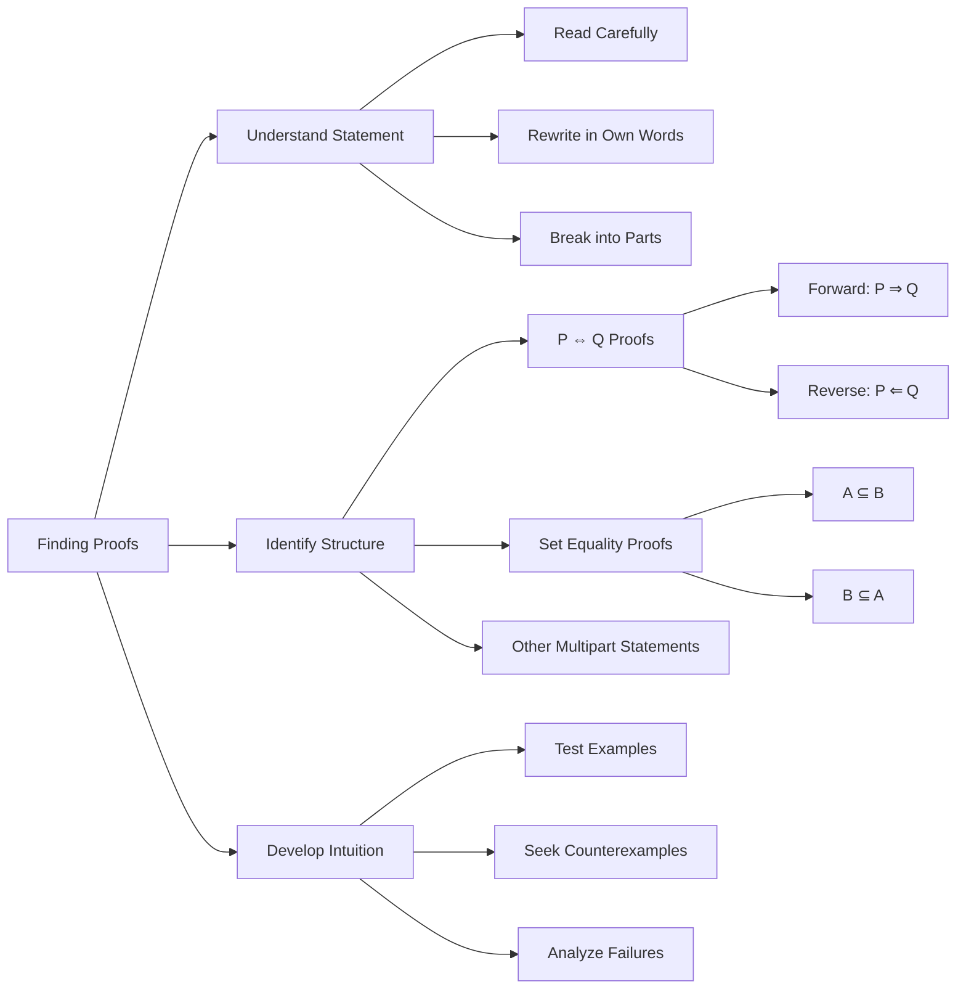

19.11.25 16:46

Status:

Tags: 
- [[Information Theory]] 
- [[Introduction to Information Theory 0]] 

------------------------------------------------------------------------
# Definitions, Theorems, and proofs - 0.3
------------------------------------------------------------------------
## Definitions, Theorems, and proofs

### Definitions

- Describe the objects and notions that we use
- A definition may be simple (*set*) or complex (*security*) in a cryptographic system
- Precision is essential to any mathematical definition
- Must be made clear what constitutes that object and what doesn't

### Mathematical Statements: 

- Usually expresses some object has a certain property
- Statement may or may not be true
	- but, like a decision it must be precise
	- There must not be any ambiguity about it's meaning

### Proof

- Convincing logical argument that a statement is true
- proof beyond any doubt is must

### Theorem

- Mathematical statement proved to be true
	- Generally reserved for statements of special interest
	  
- Sometimes we prove statements only because they assist in proof of another, more significant statement
	- Such proofs are called **lemmas**
	  
- A theorem or its proof may allow us to conclude that other, related statements are true
	- Such statements are called as **Corollaries** of the theorem

## Finding Proofs
%% page 17 (37) %%
- Only way to determine truth or falsity of a statement is through mathematical proof

### General strategies

- Carefully read the statement to prove
- Understand the notation
	- Rewrite in own words
- Break it down and consider each part separately

### Multipart Statements:

- Some multipart statements are not immediately evident
- Often one direction is easier than the other
	
- Example 1:
	- $P\ if\ and\ only\ if\ Q$ ($P \iff Q$)
	- **Shorthand for two parts:**
	- **Forward direction**: "P only if Q" → $P \Rightarrow Q$    
    - **Reverse direction**: "P if Q" → $P \Leftarrow Q$
	- **Proof requirement**: Must prove **both directions**    
	
- Example 2:
	- $Set Equality$ ($A = B$)
	- **Two parts to prove:**
    - $A \subseteq B$: Every member of A is also member of B  
    - $B \subseteq A$: Every member of B is also member of A
    - Prove **both subset relations** to establish equality

### Developing Intuition:

- Get "gut feeling" for why statement should be true
- **Experiment with examples:**
    - If statement claims "all objects of type T have property P":
        - Pick few objects of type T and verify property P
        - Try to find **counterexample** (object that fails property P)
        - If statement is true, no counterexample exists
- **Difficulty finding counterexample** can reveal why statement is true

### Proof Approaches:

- **Direct proof**: Logical deduction from known facts
    
- **Proof by contradiction**: Assume opposite, show contradiction
    
- **Proof by cases**: Break into all possible scenarios
    
- **Induction**: Prove base case and inductive step

## 

# References

-----------------------------------------------------------------------
# Closely Related Notes

## Next:

## Prev: [[Mathematical Notions and Terminology in Information Theory 0.2]]

## Closely Related Notes:
