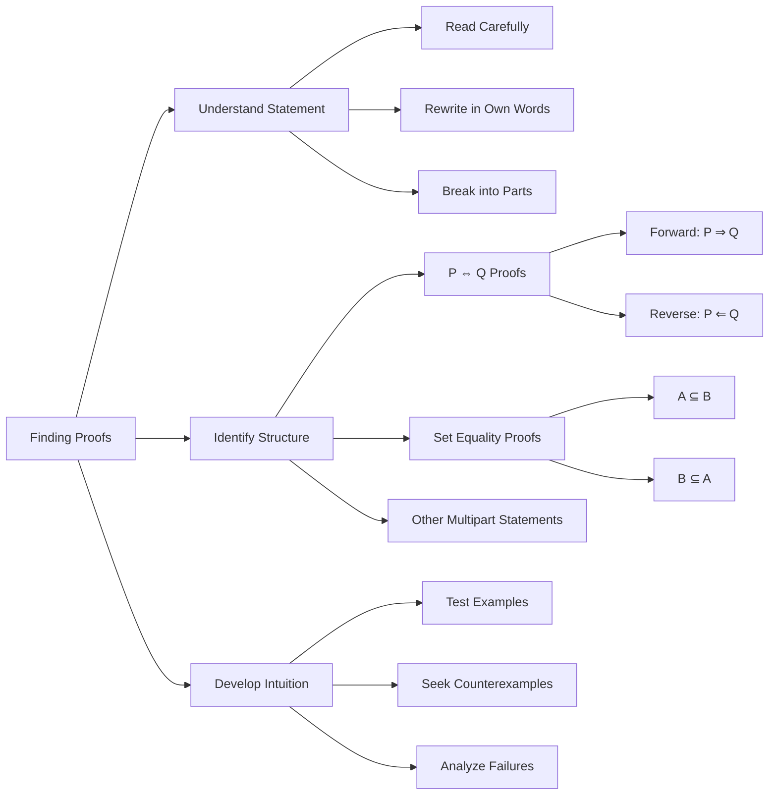
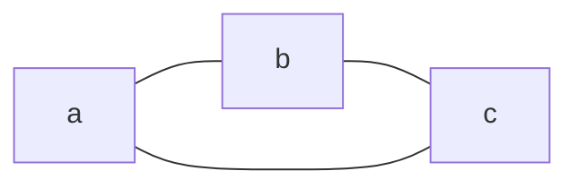
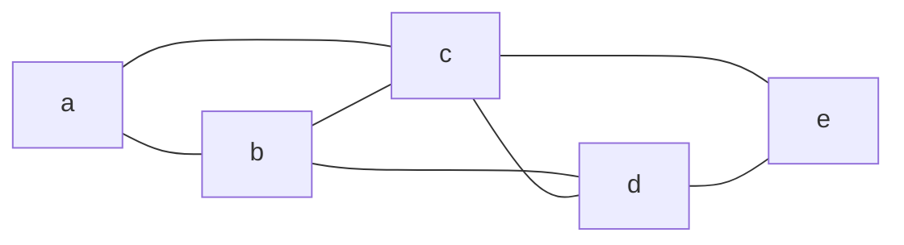

19.11.25 16:46

Status:

Tags: 
- [[Introduction to Information Theory 0]] 

------------------------------------------------------------------------
# Definitions, Theorems, and proofs - 0.3
------------------------------------------------------------------------
## Definitions, Theorems, and proofs

### Definitions

- Describe the objects and notions that we use
- A definition may be simple (*set*) or complex (*security*) in a cryptographic system
- Precision is essential to any mathematical definition
- Must be made clear what constitutes that object and what doesn't

### Mathematical Statements: 

- Usually expresses some object has a certain property
- Statement may or may not be true
	- but, like a decision it must be precise
	- There must not be any ambiguity about it's meaning

### Proof

- Convincing logical argument that a statement is true
- proof beyond any doubt is must

### Theorem

- Mathematical statement proved to be true
	- Generally reserved for statements of special interest
	  
- Sometimes we prove statements only because they assist in proof of another, more significant statement
	- Such proofs are called **lemmas**
	  
- A theorem or its proof may allow us to conclude that other, related statements are true
	- Such statements are called as **Corollaries** of the theorem

## Finding Proofs
%% page 17 (37) %%
- Only way to determine truth or falsity of a statement is through mathematical proof

### General strategies

- Carefully read the statement to prove
- Understand the notation
	- Rewrite in own words
- Break it down and consider each part separately

### Multipart Statements:

- Some multipart statements are not immediately evident
- Often one direction is easier than the other
	
- Example 1:
	- $P\ if\ and\ only\ if\ Q$ ($P \iff Q$)
	- **Shorthand for two parts:**
	- **Forward direction**: "P only if Q" → $P \Rightarrow Q$    
    - **Reverse direction**: "P if Q" → $P \Leftarrow Q$
	- **Proof requirement**: Must prove **both directions**    
	
- Example 2:
	- $Set Equality$ ($A = B$)
	- **Two parts to prove:**
    - $A \subseteq B$: Every member of A is also member of B  
    - $B \subseteq A$: Every member of B is also member of A
    - Prove **both subset relations** to establish equality

### Developing Intuition:

- Get "gut feeling" for why statement should be true
- **Experiment with examples:**
    - If statement claims "all objects of type T have property P":
        - Pick few objects of type T and verify property P
        - Try to find **counterexample** (object that fails property P)
        - If statement is true, no counterexample exists
- **Difficulty finding counterexample** can reveal why statement is true

### Proof Approaches:

- **Direct proof**: Logical deduction from known facts
    
- **Proof by contradiction**: Assume opposite, show contradiction
    
- **Proof by cases**: Break into all possible scenarios
    
- **Induction**: Prove base case and inductive step

## Examples of Proof

- **Example 0.19**
	- Suppose we need to prove *for every Graph $G$, the sum of degrees of all nodes in $G$ is an even number
	
- **First**, Pick a few graphs and observe this statement in action

- Example 1
	- 2(a) + 2(b) + 2(c) = 6

- Example 2
	- 2(a) + 3(b) + 4(c) + 3(d) + 2(e) = 14

- **Secondly**, Try to prove a special case of the statement
	- When trying to prove a statement for k > 0
		- try to prove for k = 1
		- then for k = 2
		- and so on until the more general case can be understood
	- If a special case is hard to prove
		- try a special case or perhaps a special case of the special case

- **Finally** When a proof is found we must write it up properly
	- A well written proof is a sequence of statements,
	- each followed by a simple reasoning from previous statements in the sequence
	- Carefully writing a proof is important 
		- for reader to understand
		- for us to be sure that it is error free

- **Tips**
	- Be patient
	- Come back to it
	- Be neat
	- Be concise

### Theorem 0.20
%% page 20 (41) %%
-  For any two sets $A$ and $B$,  $\overline{A \cup B} = \overline{A} \cap \overline{B}$
	
- Recall that we may prove 2 sets are equal by proving
	- Each member of one set also is a member of the other and vice versa
	  
- Theorem states 2 sets $\{\overline{A \cup B}\} = \{\overline{A} \cap \overline{B}\}$
	
- $1^{st}\ way$ 
- suppose $x$ is an element of   $\overline{A \cup B}$
	- then $x$ is not in  ${A \cup B}$ 
		- from definition of *complement*
	- then $x$ is not in $A$ and $x$ is not in $B$
		- from definition of *Union of sets*
	- In other words x is in $\overline{A}$ and  $\overline{B}$
	- Then $x$ is in  $\overline{A \cap B}$
		- by definition of *intersection of sets*
	
-  $2^{nd}\ way$ 
- In other direction continue the same proof

### Theorem 0.21 - Handshaking Lemma Proof
%% page 21 (42) %%

**Theorem**: In any graph $G$, the sum of the degrees of all nodes equals $2e$, where $e$ is the number of edges.

**Proof**:

- Every edge in $G$ is connected to **two nodes**
    
- Each edge contributes:
    
    - $+1$ to the degree of **each** connected node
        
    - $+2$ to the **total sum** of all node degrees
      
- Therefore, if $G$ contains $e$ edges:
    
    - Sum of all degrees = $2e$
      
- Since $2e$ is always even: 
	
- ***Sum of all node degrees is always even***
	
- $\sum_{v\ \in\ V}\ (\deg(v)) = 2|E|$

# References

-----------------------------------------------------------------------
# Closely Related Notes

## Next: 
- Types of Proof 0.4

## Prev: 
- Mathematical Notions and Terminology in Information Theory 0.2

## Closely Related Notes:
