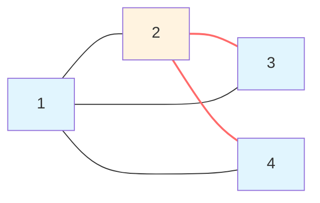
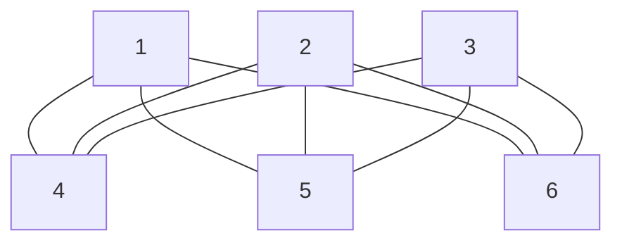

Status: 

Links: 
- Relevance Links:
	- [[Introduction to Information Theory 0]]
	
- Topic Tags:
	- [[Mathematics]]

# Exercises:

## Exercise 0.1

- **Que:**
- Examine the following formal descriptions of sets so that you understand which members they contain. Write a short informal English description of each set:

a. ${1,3,5,7,\ldots}$  
**Answer:** The set of all odd natural numbers.

b. ${\ldots,-4,-2,0,2,4,\ldots}$  
**Answer:** The set of all even integers.

c. ${n \mid n = 2m \text{ for some } m \text{ in } \mathbb{N}}$  
**Answer:** The set of all even natural numbers.

d. ${n \mid n = 8m \text{ for some } m \text{ in } \mathbb{N}, \text{ and } n = 3k \text{ for some } k \text{ in } \mathbb{N}}$  
**Answer:** The set of all natural numbers that are multiples of both 8 and 3, i.e., multiples of 24.

e. ${n \mid n = 6m \text{ string of } 6 \text{ is not } 1 \text{ and } n \text{ equals the reverse of } \alpha}$  
**Answer:** This appears to have typographical errors. Likely meant: The set of numbers that are multiples of 6 and palindromic (equal to their reverse).

f. ${n \mid n = 8m \text{ integer and } n = n + 1}$  
**Answer:** This appears to have errors. Likely meant: The set of integers that are multiples of 8 and satisfy some additional condition.

## Exercise 0.2

- **Question:**
- Write formal descriptions of the following sets:

a. The set containing the numbers $1,10,$ and $100$  
**Answer:** ${1, 10, 100}$

b. The set containing all integers that are greater than 5  
**Answer:** ${x \mid x \in \mathbb{Z} \text{ and } x > 5}$

c. The set containing all natural numbers that are less than 5  
**Answer:** ${x \mid x \in \mathbb{N} \text{ and } x < 5}$

d. The set containing the string "has"  
**Answer:** ${"has"}$

e. The set containing the empty string  
**Answer:** ${\epsilon}$ or ${\lambda}$

f. The set containing nothing at all  
**Answer:** $\emptyset$ or ${}$

## Exercise 0.3

Let $A$ be the set ${x,y,z}$ and $B$ be the set ${x,y}$.

- a. Is $A$ a subset of $B$?  
- **Answer:** 
	- No,
	- $A \nsubseteq B$

- b. Is $B$ a subset of $A$?  
- **Answer:** 
	- Yes, 
	- $B \subseteq A$

- c. What is $A \cup B$?  
- **Answer:** 
	- ${x,y,z}$

- d. What is $A \cap B$?  
- **Answer:** 
	- ${x,y}$

- e. What is $A \times B$?  
- **Answer:** 
	- ${(x,x), (x,y), (y,x), (y,y), (z,x), (z,y)}$

- f. What is the power set of $B$?  
- **Answer:**
	- $\mathcal{P}(B) = {\emptyset, {x}, {y}, {x,y}}$

## Exercise 0.4

- If $A$ has $a$ elements and $B$ has $b$ elements, how many elements are in $A \times B$? Explain your answer.  
- **Answer:**
	- $a \times b$ elements,
	- since each element of $A$ pairs with each element of $B$.

## Exercise 0.5

- If $C$ is a set with $c$ elements, how many elements are in the power set of $C$? Explain your answer.  

- **Answer:**
	- $2^c$ elements,
	- since each element can either be included or excluded from a subset.

## Exercise 0.6

Let $X$ be the set ${1,2,3,4,5}$ and $Y$ be the set ${6,7,8,9,10}$. The unary function $f: X \longrightarrow Y$ and the binary function $g: X \times Y \longrightarrow Y$ are described in the following tables.

**Function $f$:**

| $n$ | $f(n)$ |
| --- | ------ |
| 1   | 6      |
| 2   | 7      |
| 3   | 6      |
| 4   | 9      |
| 5   | 6      |

**Function $g$:**

| $g$ | 6   | 7   | 8   | 9   | 10  |
| --- | --- | --- | --- | --- | --- |
| 1   | 10  | 10  | 10  | 10  | 10  |
| 2   | 7   | 8   | 9   | 10  | 6   |
| 3   | 7   | 7   | 8   | 8   | 9   |
| 4   | 9   | 9   | 9   | 9   | 9   |
| 5   | 6   | 6   | 6   | 6   | 6   |

a. What is the value of $f(2)$?  
**Answer:** $7$

b. What are the range and domain of $f$?  
**Answer:** Domain: ${1,2,3,4,5}$, Range: ${6,7,9}$

c. What is the value of $g(4,10)$?  
**Answer:** $9$

d. What are the range and domain of $g$?  
**Answer:** Domain: $X \times Y$, Range: ${6,7,8,9,10}$

e. What is the value of $g(4,f(4))$?  
**Answer:** $f(4) = 9 \implies g(4,9) = 9$

## Exercise 0.7

For each part, give a relation that satisfies the condition.

a. Reflexive and symmetric but not transitive  
**Answer:** $R = {(1,1), (2,2), (3,3), (1,2), (2,1), (2,3), (3,2)}$ on ${1,2,3}$

b. Reflexive and transitive but not symmetric  
**Answer:** $R = {(1,1), (2,2), (3,3), (1,2)}$ on ${1,2,3}$

c. Symmetric and transitive but not reflexive  
**Answer:** $R = {(1,2), (2,1)}$ on ${1,2,3}$ (missing $(3,3)$)

## Exercise 0.8

- **Question:** 
- Consider the undirected graph $G = (V, E)$ where $V$, the set of nodes, is ${1,2,3,4}$ and $E$, the set of edges, is $\{\{1,2\}, \{2,3\}, \{1,3\}, \{2,4\}, \{1,4\}\}$.
- Draw the graph $G$. What is the degree of node $1$? of node $3$? Indicate a path from node $3$ to node $4$ on your drawing of $G$.

- **Answer:**
	
- Degree of node 1: 2 (edges to 2 and 4)
    
- Degree of node 3: 1 (edge to 2)
    
- Path from node 3 to node 4: $3 \to 2 \to 4$

Note: The edge ${2,4}$ appears twice in the set description, but in set notation, duplicates are ignored, so it's only counted once.

## Exercise 0.9

- **Question:**
- Write a formal description of the following graph
 

- **Formal Description:**  
- Let G=(V,E) where:
	- V={1,2,3,4,5,6}
    
	- E={{1,4},{1,5},{1,6},{2,4},{2,5},{2,6},{3,4},{3,5},{3,6}}E={{1,4},{1,5},{1,6},{2,4},{2,5},{2,6},{3,4},{3,5},{3,6}}

## Exercise 0.10
Find the error in the following proof that 2=1.

**Proof Steps:** // needs fix #fix

1. Let a=b
    
2. Multiply both sides by a: a=b, a2=ab
    
3. Subtract b2b2: a2−b2=ab−b2a2−b2=ab−b2
    
4. Factor: (a+b)(a−b)=b(a−b)(a+b)(a−b)=b(a−b)
    
5. Divide by (a−b)(a−b): a+b=ba+b=b
    
6. Substitute a=b=1a=b=1: 2=12=1
    

**Error:**  
The division by (a−b)(a−b) is invalid because a=b implies a−b=0. Division by zero is undefined.

---

**Exercise 0.11**  
Find the error in the following proof that all horses are the same color.

**Proof by Induction:**

- **Base Case:** For h=1h=1, trivially true.
    
- **Inductive Step:** Assume true for h=kh=k. For h=k+1h=k+1, remove one horse to get set H1H1​ (size kk), all same color. Replace and remove a different horse to get H2H2​ (size kk), all same color. Thus, all horses in HH are the same color.
    

**Error:**  
The inductive step fails for k=1k=1. When k+1=2k+1=2, sets H1H1​ and H2H2​ are disjoint (each contains one horse). There is no overlapping horse to connect the colors, so the conclusion doesn't follow.

---

**Exercise 0.12**  
Show that every graph with 2 or more nodes contains two nodes that have equal degrees.

**Proof:**  
In a graph with nn nodes, possible degrees are 0,1,2,…,n−10,1,2,…,n−1. However, if a node has degree n−1n−1, no node can have degree 00, and vice versa. Thus, the nn nodes can have at most n−1n−1 distinct degrees. By the pigeonhole principle, at least two nodes must have the same degree.

---

**Exercise 0.13**  
Ramsey’s Theorem: Every graph with nn nodes contains either a clique or an anti-clique with at least 12log⁡2n21​log2​n nodes.

**Proof Sketch:**  
Let R(s)R(s) be the minimum nn such that any graph on nn nodes contains a clique or anti-clique of size ss. Known bounds give R(s)≤4sR(s)≤4s. Solving 4s≥n4s≥n yields s≥12log⁡2ns≥21​log2​n. Thus, any graph with nn nodes must contain a clique or anti-clique of size at least 12log⁡2n21​log2​n.

**Detailed Steps:**

1. Use induction on nn.
    
2. For any node vv, partition remaining nodes into neighbors and non-neighbors.
    
3. One partition must have size ≥n−12≥2n−1​.
    
4. Apply inductive hypothesis to find a clique or anti-clique in that partition.
    
5. Combine with vv to get the desired size.
    

**Result:**

Maximum clique or anti-clique size≥12log⁡2nMaximum clique or anti-clique size≥21​log2​n

# References

## Closely Related Notes

### Next:

### Prev: 
- Types of Proof 0.4

