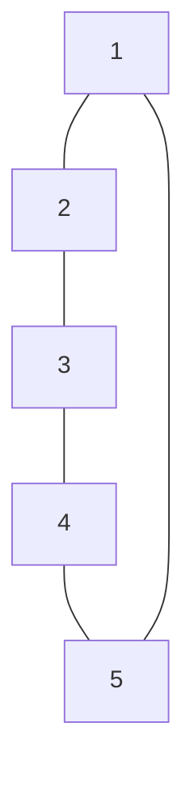
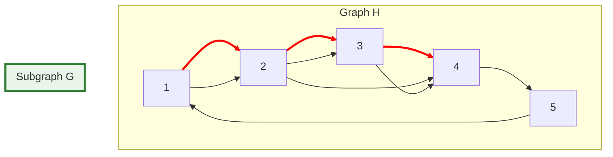
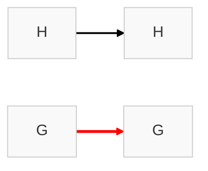
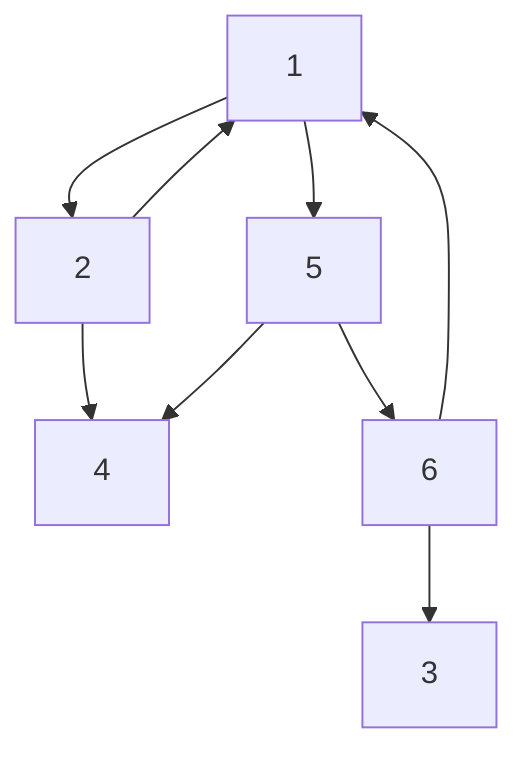
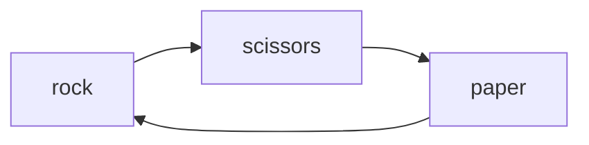

********
2025-11-15 21:41

Status:
Hashtags: 
- Primary tags: #theory-of-computation #mathematical-foundations 
- Specific tags: #set-theory #sequence #tuple #functions #predicate #descrete-mathematics #k-ary-functions #cartesian-productw

Links: 
- Relevance Tags:
	- [[Introduction to Information Theory 0]]
	
- Topic Tags:
	- [[Mathematics]]

------------------------------------------------------------------------
# Mathematical Notions and Terminology in Information Theory - 0.2
%% pages: 3 - 16  %%

## Sets
- Group of objects represented as a unit
- Can contain any type of object, symbols, and even other sets\
- **Member:**  Objects in a set
- **Notation** : {1, 2, 3, 4} - example of a set
- $\in$ -> membership
- $\notin$ -> non - membership

### Properties
- The order of describing set elements doesn't matter
- The repetition of a sets members doesn't matter

### Subset
- A is subset of B (**A $\subseteq$ B**) if every member of A is also a member of B

### Proper Subset
- A is a **proper subset** of B (**A $\subsetneq$ B**) if A is a subset of B and is not equal to B
- Example:
	- A = {1, 2, 3, 4}
	- B = {1, 2, 3, 4, 5}
	- $\because$ A is a subset of B (A $\subseteq$ B) and A is not equal to B (A $\neq$ B) => A $\subsetneq$ B

### Multiset
- Sets in which number of occurrences of members is taken into account
- {7} , {7, 7} are different as multisets but same as sets

### Infinite Set
- Has infinitely may elements
- we use the "..." notation to mean -> "continue the sequence forever"
- Example:
	1. Set of 'natural numbers (N)' -> {1, 2, 3, ...}
	2. Set of 'integers (Z)' -> { ..., -2, -1, 0, 1, 2, 3, ... }

### Empty Set
- A set with no elements / 0 elements is called an **empty set**
- Denoted as $\emptyset$

### Power set
- Set of all subsets of a Set A is called as the Power Set of A
- **example:** 
	- Consider $A$  = $\{0, 1\}$
	- Subsets of $A$  are $\emptyset$, $\{0\}$, $\{1\}$, $\{0, 1\}$
	- The set of all subsets of $A$ => Let it be $B$ = $\{\emptyset, \{0\}, \{1\}, \{0, 1\}\}$
	- Then  Power set of $A$ =  $\mathcal{P}(A)$ = $B$ 

### Describing a Set
- There are 10 ways or more ways to describe a set
	1. Roster Notation
	2. Set-Builder Notation
	3. Predicate-Only Notation
	4. Interval Notation
	5. Describing with words
	6. Recursive Definition
	7. Definition by construction
	8. Power Set Notation
	9. Cartesian Product Form
	10. Comprehension with Multiple Conditions

#### Most Common Set Descriptions:

##### 1. Roster Form
- Used when sets are small and finite
- Examples:
	1. A = {1, 3, 5}
	2. Y = {$q_1$, $q_2$}

##### 2. Set-Builder /Comprehension Notation
- Used mainly for Infinite, rule-based sets
- General Form:
	- {x | condition on x}
	- example: 
		1. {X | X $\in$ $\mathbb{N}$  } 

##### 3. Pattern Form (Languages) / Mathematical Descriptions
- Very common for languages
- { $9^{n}$ | $n$ $>$ $0$ }

## Sequences and Tuples
- **Definition:** List of objects in some order
- Order and repetition of objects matters in  a Sequence
- Example: 
	- $(a, b, c)$ and $(c, a , b)$ are not the same Sequence
	- $(a, a, b, c)$ and $(a , b, c)$ are not the same Sequence

### Tuples
- **Definition:** A finite sequence is also called as a *tuple*
- A sequence with k elements is called a k-tuple
- A 2-tuple is also called a pair
- Sets and Sequences may appear as elements of other sets and sequences

### Cross Product - Cartesian Product
- Consider $A$ and $B$ are two sets, 
- **Definition:** Set of all pairs where the first element is a member of $A$ and the second member is a member of $B$
- **Notation:** $A \times B$ <=> Cartesian Product or Cross Product of $A$ and $B$
- Example:
	- $A$  = $\{1, 2\}$, $B$  = $\{x, y, z\}$
	- $A \times B$ = $\{(1, x), (1, y), (1, z), (2, x), (2, y), (2, z)\}$

- We can also take Cartesian Product of a ***k*** Sets, $A_1$, $A_2$, ...., $A_k$, written as $A_1$ X $A_2$ X .... X $A_k$
	- It will be a set consisting of k-tuples $(a_1, a_2, ...., a_k)$ where $a_i \in A_i$

- If we have Cartesian Product of a set with itself
	- we can use the shorthand $A \times A \times A \times ... _{ktimes} ...$ = $A^K$
		- example: $A \times A \times A = A^3$

## Functions

- ### Functions
	- **Definition:** Function or a Mapping is an 
		- Object that sets up an input-output relationship
	- A function takes Input and gives Output
		- Same Input always should produce same Output
	- **Notation:** A function $f$ whose input is $a$ and output is $b$ 
		- $f(a) = b$
	
	- Example: 
		- The Absolute value function $abs$ takes a number $x$ as input & return $x$ if positive or $-x$ if negative
			- $\therefore$ $abs(2) = abs(-2) = 2$
	  
- ### Domain and Range
	- Set of possible Inputs to a function is called Domain
	- Outputs of a function come from a set called it's Range
	- **Notation:** A function $f$ with Domain $D$ and Range $R$
		- $f : D \mapsto R$
	- Example:
		- Consider the function $abs$ while working with Integers $\mathbb{Z}$
			- The Domain $D$ is  $\mathbb{Z}$
			- The Range $R$  is  $\mathbb{Z}$
			- so we write => $abs:$  $\mathbb{Z}$ $\mapsto$  $\mathbb{Z}$
	- Input of a function is also called an argument  
	  
	  
- ### Onto Function
	- A function that uses all the elements of the range
	- Example:
		- Consider the function $f$ : $\{0, 1, 2, 3, 4\}$ $\mapsto$ $\{0, 1, 2, 3, 4\}$
		- This function adds one to its input and outputs the result modulo 5
		- so, $f$ : $\{0, 1, 2, 3, 4\}$ $\mapsto$ $\{0, 1, 2, 3, 4\}$ is an onto function

| n   | f(n) |
| --- | ---- |
| 0   | 1    |
| 1   | 2    |
| 2   | 3    |
| 3   | 4    |
| 4   | 0    |

- ### n - Dimensional Domain
	
	#### 2 - Dimensional Domain
	- Consider a function $g : \mathbb{Z}_{4} \times \mathbb{Z}_{4} \mapsto \mathbb{Z}_{4}$
		- The entry at row label $i$ and column $j$ is the value of $g(i, j)$
		- function $g$ is addition function modulo 4
		- $i$ and $j$ or input of a function is also called an argument
		- Certain binary functions are written in *infix* notation instead of *prefix* notation
		- example: 
			- addition function $add$ is written as $a + b$ --> $infix\ notation$
			- instead of $add(a, b)$ --> $prefix\ notation$

| g   | 0   | 1   | 2   | 3   |
| --- | --- | --- | --- | --- |
| 0   | 0   | 1   | 2   | 3   |
| 1   | 1   | 2   | 3   | 0   |
| 2   | 2   | 3   | 0   | 1   |
| 3   | 3   | 0   | 1   | 2   |

- #### k-ary functions
		- A function with $k$ arguments is called a k-ary function
			- For ex, when the domain is $A_1 \times A_2 \times .... \times A_k$ 
			- Input = $(a_1, a_2, ...., a_k)$ --> k-tuple input --> k-ary function
		- $k$  ---> arity of the function

| k   | name            |
| --- | --------------- |
| 1   | unary function  |
| 2   | binary function |

### Infix and Prefix notations

- #### Prefix Notation
	- Standard Mathematical Function Notation
	- *Operator* comes before (*pre*-) the *operands*
	- Formal definitions often use *prefix* notations as they are more precise
	- **Structure:** $operator(operand1, operand2)$
	- Examples:
		1. $add(3, 4)$
		2. $multiply(3, 4)$

- #### Infix Notation
	- Used for familiar binary operations for readability
	- *operator* comes between (in-) the *operands*
	- **Structure:** $operand1\ operator\ operand2$
	- Examples:
		1. $2 + 3$ : addition of 2 and 3
		2. $P \land Q$ : Conjunction of $P$ and $Q$

### Predicate / Property

- **Definition:** Function whose range is $\{True, False\}$
	- Input : Any Domain
	- Output:  $\{True, False\}$
	
- **Formal Definition:** 
	- If $P$ is a *predicate*
		- $P: D \mapsto \{True, False\}$ 
		- Domain $D$ can be any set
		- Range will always be the boolean values $\{True, False\}$
	
- **Examples**
	- $even(n)$ = "n is an even number"
		- $even(4)$ = $True$
		- $even(1)$ = $False$
	- $vowel(c)$ = "c is a vowel"
		- $vowel('a')$ = $True$
		- $vowel('x')$ = $False$
	
- **Alternative Representation**
	- $S = \{X \in D | P(x) = True\}$
		- same as predicate $P: D \mapsto \{True, False\}$
	- Example:
		- $even$ predicate = $\{0, 2, 4, ...\}$
	
- **Importance in Theory of Computation** 
	- Decision Problems -> Predicates over strings
	- Language Membership -> Predicate testing if string is in language
	- Undecidability Proofs -> Rely on predicates about program behaviour
	- Formal Verification -> Uses Predicates to specify system properties
	
- **Key Insights**
	- many computational questions in computation theory boil down to 
	  asking whether certain predicates are *computable* / *decidable*

## Relations

### Relations
- **Definition** A predicate whose domain is a set of *k-tuples* $A \times A \times ... \times A$ 
	- Also called as k-ary relation or k-ary relation on A
	- A input can be related to one or more values
	  
- A common case is a 2-ary relation or binary relation
	- When writing an binary relation expression
	- infix is customarily used
	- ex: $2 < 3$
	  
- If $R$ is a binary relation or if $R$ is a k-ary relation 
	- $aRb$  $\iff$ $aRb = True$
	  
	
- Sometimes describing predicates with sets instead of functions is more convenient
	- Consider the game Rock, Paper, Scissors
	- Domain $D : \{Rock, paper, Scissors\}$
	- Range $R : \{True, False\}$
	- Relation $aRb$ (or) $a\ beats\ b$ (or) $S = \{a \in D\ |\ P(a) = True\}$

### Properties of Relation
	
#### Reflexive Relation
- **Definition:** Every element is related to itself
- **Formal Condition:** For every $x$, $xRx$ is valid
- Examples:
	- The "is equal to" relation (=) on the set of numbers
		- Every number is equal to itself
		- So the Reflexive property is satisfied by the relation "is equal to"
	- The "lives in the same city as" relation
		- You always live in the same city as yourself
		- So the relation "lives in the same city" is Reflexive
		
#### Symmetric Relation
- **Definition:** If $x$ is related to $y$, then $y$ is also related to $x$
- **Formal Condition:** If $xRy$, then $yRx$
- Examples:
	- The "is married to" relation
		- If **Jack** is married to **Kavya**
		- **Kavya** is married to **Jack**
		- So $xRy$, then $yRx$ is satisfied by "is married to" Relation
		- $\therefore$ "is married to" is a Symmetric Relation
		  
	- The "is perpendicular to" relation
		- If $L_1$ $\perp$ $L_2$ are then we know $L_2 \perp L_1$
		- So by "is Perpendicular to" Relation satisfies the Symmetric condition
		- $xRy$, then $yRx$   $\implies$  is a Symmetric Relation
		
#### Transitive Relation
- **Definition:** If x is related to y, and y is related to z, then x is related to z.
- **Formal Condition:** If $xRy$ and $yRz$, then $xRz$.
- **Examples:**
	- The "is an ancestor of" relation.
		- If Alice is an ancestor of Bob, and Bob is an ancestor of Charlie
		- then Alice is an ancestor of Charlie).
		- $\therefore$ "is ancestor to" is a Transitive Relation
	- The "is less than" relation (<) on numbers
		- Consider $a, b, c$ are three Natural
		- If $a < b$ and $b < c$ we know that $a < c$
		- $\therefore$ The relation "is less than" is Transitive
		  
#### Equivalence Relation

- **Definition:** A relation that is **reflexive, symmetric, and transitive** all at once.
- **Purpose:** Groups elements into "equivalence classes" where everything in a group is considered the same according to the rule.
- **Notation:** $a \sim b$ means a is equivalent to b
- **Simple Example:**
	- The "has the same birthday as" relation.
		
		- **Reflexive:** You have the same birthday as yourself.
			
		- **Symmetric:** If person A has the same birthday as person B, then B has the same birthday as A.
			
		- **Transitive:** If A has the same birthday as B, and B has the same birthday as C, then A has the same birthday as C.
			
		- This relation partitions all people into groups (equivalence classes) based on their birthday.
		
###  Example Exercises

#### Example 1 (0.11)
 
 - Define an Equivalence Relation on $\mathbb{N}$, written $\equiv_7$ 
 - For  $i, j \in \mathbb{N}$ say that $i \equiv_7 j$, if $i - j$ is a multiple of 7
 - This is a Equivalence relation
	 - **Reflexive:**  $i - i = 0$;  $0$ is a multiple of $7$ $\implies$ It's Reflexive
	 - **Symmetric:** $\because \ i - j$  is a multiple of $7$ $\iff$ $j - i$ is a multiple of $7$ $\implies$ It's Symmetric
	 - **Transitive:** $\because \ i - j$  is a multiple of $7$  &  $\because \ j - k$  is a multiple of $7$
		 - $i - k = (i -j) + (j - k)$ = sum of two multiples of 7 $\implies$ $i - k$ is a multiple of 7
		 - $\therefore i - k$ is a multiple of $7$
	 - $\therefore$  The relation $\equiv_7$ is Reflexive, Symmetric, and Transitive $\implies$ $\equiv_7$ is an Equivalence Relation

## Graphs

### Graphs

- **Definition:** 
	- Graph Undirected Graph is a set of points with lines connecting some of the points
	- Nodes or Vertices are the points
	- The lines are the Edges
	- Degree: The number of edges / lines at a particular node
	  
- No more than one edge is allowed between 2 nodes
- The order of arguments doesn't matter in an Undirected graph
- **Directed Graph:-** If a graph has arrows instead of lines its called a directed graph
	- No. of arrows pointing out from a particular node is outdegree
	- No. of arrows pointing in to a particular node is indegree
- if $i, j$ are nodes in a Graph
	- Then $(i, j)$ represents the edge that connects $i$ and $j$
	- $(i, j)$ and $(j, i)$  represent the same edge
- Sometimes we describe edges $(i, j)$ as sets $\{i, j\}$ instead of pairs if the order of nodes is unimportant
- A Graph where we label the Nodes and / or Edges is called a Labeled graph
  
- **Formal Definition:** 
	- $G = (V, E)$ 
	- Here; $V$ -> Set of Nodes, $G$ and $E$ -> set of Edges
  
- We can describe a Graph $G$ with a diagram like below or more formally by specifying $V$ and $E$ 

- Consider the Graph $G = (\{1, 2, 3, 4, 5\}, \{(1, 2), (2, 3), (3, 4), (4, 5), (5, 1)\})$
  

### Sub Graph

- **Definition:-** We say that a Graph $G$ is a Sub-Graph of Graph $H$ if all the nodes of $G$ are a subset of the nodes of $H$.
	- The edges of $G$ are the edges of $H$ on the corresponding nodes

### Path
- **Definition:-** A path in a Graph is the sequence of nodes connected by edges
- **Simple path**: A path doesn't repeat any nodes

- A path is **Connected** if all the nodes have a path between them

- **Cycle:** A path is a cycle if it starts and on the same node
  
- **Simple Cycle:** is a cycle that contains 3 nodes and repeats only the first and last node (both same node)

- **Tree:** A graph that is connected and has no simple cycles
	- A tree may contain a specially designated node called **root**
	- Nodes of degree 1 other than the root are called leaves of the tree

### **Directed Graph:-** (Graph type)

- If a graph has arrows instead of lines its called a directed graph
	- No. of arrows pointing out from a particular node is outdegree
	- No. of arrows pointing in to a particular node is indegree
	- In a directed we represent an edge from $i$ to $j$ as pairs $(i, j)$
	- Handy way to represent Binary relations
	- Example:
		- A graph with formal description $(\{1, 2, 3, 4, 5, 6\},  \{(1, 2), (1, 5), (2, 1), (2, 4), (5, 4), (5, 6), (6, 1), (6, 3)\}$ would be

- **Directed Path:-** (path)
	- A path in which all the arrows point in the same direction as its steps is called a directed path
- **Strongly Connected:-**
	- A directed graph is strongly connected if a directed path connects every two nodes

## Strings and Languages
%% page - 13 (34) %%
- **Alphabet** $\Sigma$ / $\Gamma$ is a finite set of objects, called **symbols**
	- Example: 
		- $\Sigma_1 = \{0, 1\}$
		- $\Sigma_2 = \{a, b, c , d\}$
		- $\Gamma = \{0, 1, x, y, z\}$
    
- A **symbol** $a \in \Sigma$ is a member of an alphabet
    
- A **string** $w$ over alphabet $\Sigma$ is a finite sequence of symbols from $\Sigma$
	
- **Language** is the Set of strings
    
- **Empty string** $\varepsilon$ has length 0
	 
- **String over an alphabet:** 
	- finite sequence of symbols from that alphabet not separated by commas
	- Usually written next to one another
	- Consider $\Sigma_1 = \{0, 1\}, \ \ \ \Sigma_2 = \{a, b, ..., y, z\}$ alphabet sets
		- $01001$ is a string over $\Sigma_1$
		- $abracadabra$ is a string over $\Sigma_2$
	
- **Length:** $|\omega|$
	- Length $|\omega|$ of a string $\omega$ is the number of symbols it contains
	- string of length $|\omega| = 0$ is called an Empty string  $\varepsilon$
	- $\varepsilon$ plays the role of $0$ in a number system
	
- **Reverse of a string** $\omega^R$
	- Consider $\omega$ has length $n$, $\implies$ $\omega = \omega_1 \ \omega_2 \ ... \ \omega_n \ \ | \ \omega_i \in \Sigma$
	- Then $\omega^R$ is the string obtained by writing $\omega$ in the opposite order $\omega = \omega_n \ \omega_{n-1} \ ... \ \omega_2 \ \omega_1 \ | \ \omega_i \in \Sigma$
	
- **Sub string**
	- A string z is a sub-string of $\omega$ if z appears consecutively within $\omega$
	- Ex: $cad$ is a sub-string of $abracadabra$
	
- **Concatenation**
	- consider 2 strings $x, y$ with lengths $m , n$
	- Concatenation of $x, y$, written $xy$ is string obtained by appending $y$ at the end of $x$
	- if $x$ is $x_1 .... x_m$ and $y$ is $y_1 ... y_n$ then their concatenation would look like $x_1\ ...\ x_m\ y_1\ ....\ y_n$
	
- **Lexicographic Ordering**
	- Same as the dictionary order but with the shorter strings precede longer strings
	- Example:
		- For $\Sigma = \{0, 1\}$ 
		- The ordering of all the strings is $(\varepsilon, 0, 1, 01, 10, 11, 100\ ...)$

## Boolean Logic
%% page - 35 (14) %%
- Mathematical logic built around two values $\{True, False\}$
- Foundation of Digital Electronics and Computer Design
- $\{True, False\}$ are called the Boolean values represented using $1, 0$ respectively

## **Boolean Operations:**

- Operations designed for manipulating Boolean values

### NOT
- negation or NOT is one of the simplest Boolean operations
	- Denoted using $\neg$
	- Negation of a Boolean value is its opposite value
		- Thus $\neg 0 = 1$ and  $\neg 1 = 0$

### AND
- conjunction or AND of two values is $1$ if both values are $1$ and $0$ otherwise
	- Denoted using $\land$
	- Thus:  $0 \land 0 = 0$;  $0 \land 1 = 0$;  $1 \land 1 = 1$

### OR
- disjunction or OR of 2 values is $0$ if  the both values are $0$ and $1$ otherwise
	- Denoted using $\lor$
	- Thus:  $0 \lor 0 = 0$;  $0 \lor 1 = 1$;  $1 \lor 0 = 1$;  $1 \lor 1 = 1$

### XOR
- exclusive or or XOR is 1 if either of the two operands are $1$ but not both
	- Denoted using $\oplus$
	- Thus:  $0 \oplus 0 = 0$;  $0 \oplus 1 = 1$;  $1 \oplus 0 = 1$;  $1 \oplus 1 = 1$

### Equality
- The equality operation is denoted using $\leftrightarrow$ is $1$ if both operands have same value

### Implication
- Denoted by $\rightarrow$
- $0$ if its first operand is $1$ and its second operand is $0$, otherwise $1$

### Distributive Law
- The distributive law for $AND$ , $OR$ comes in handy in manipulating boolean values
- $P \land (Q \lor R) = (P \land Q) \lor (P \land R)$ 
- $P \lor (Q \land R) = (P \lor Q) \land (P \lor R)$ 

- **Note:**
	- The dual of the distributive law for addition and multiplication does not hold in general

## Summary of Definitions
%% page - 37 (16) %%

| Term                 | Definition                                                                           |
| -------------------- | ------------------------------------------------------------------------------------ |
| Alphabet             | A finite set of objects called symbols                                               |
| Argument             | An input to a function                                                               |
| Binary relation      | A relation whose domain is a set of pairs                                            |
| Boolean operation    | An operation on Boolean values                                                       |
| Boolean value        | The values TRUE or FALSE, often represented by 1 or 0                                |
| Cartesian product    | An operation on sets forming a set of all tuples of elements from respective sets    |
| Complement           | An operation on a set, forming the set of all elements not present                   |
| Concatenation        | An operation that sticks strings from one set together with strings from another set |
| Conjunction          | Boolean AND operation                                                                |
| Connected graph      | A graph with paths connecting every two nodes                                        |
| Cycle                | A path that starts and ends in the same node                                         |
| Directed graph       | A collection of points and arrows connecting some pairs of points                    |
| Disjunction          | Boolean OR operation                                                                 |
| Domain               | The set of possible inputs to a function                                             |
| Edge                 | A line in a graph                                                                    |
| Element              | An object in a set                                                                   |
| Empty set            | The set with no members                                                              |
| Empty string         | The string of length zero                                                            |
| Equivalence relation | A binary relation that is reflexive, symmetric, and transitive                       |
| Function             | An operation that translates inputs into outputs                                     |
| Graph                | A collection of points and lines connecting some pairs of points                     |
| Intersection         | An operation on sets forming the set of common elements                              |
| k-tuple              | A list of k objects                                                                  |
| Language             | A set of strings                                                                     |
| Member               | An object in a set                                                                   |
| Node                 | A point in a graph                                                                   |
| Pair                 | A list of two elements, also called a 2-tuple                                        |
| Path                 | A sequence of nodes in a graph connected by edges                                    |
| Predicate            | A function whose range is {TRUE, FALSE}                                              |
| Property             | A predicate                                                                          |
| Range                | The set from which outputs of a function are drawn                                   |
| Relation             | A predicate, most typically when the domain is a set of k-tuples                     |
| Sequence             | A list of objects                                                                    |
| Set                  | A group of objects                                                                   |
| Simple path          | A path without repetition                                                            |
| String               | A finite list of symbols from an alphabet                                            |
| Symbol               | A member of an alphabet                                                              |
| Tree                 | A connected graph without simple cycles                                              |
| Union                | An operation on sets combining all elements into a single set                        |
| Vertex               | A point in a graph                                                                   |

------------------------------------------------------------------------
# References

# Related Links

## Exercises - 

## Prev - [[Automata Complexity and Computability 0.1]]

## Next - [[Definitions, Theorems, and proofs - 0.3]]

