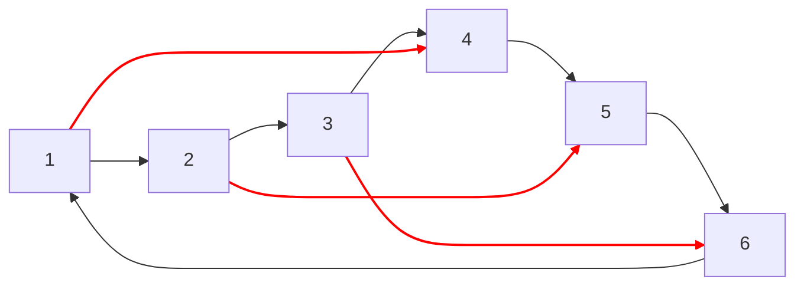

19.11.25 18:55

Status:

Tags:
- [[Information Theory]] 
- [[Introduction to Information Theory 0]] 


---
# Types of Proof 0.4
%% page 21 (42) %%

- Proof may contain more than one type of argument
	- As the proof may contain within it several different sub-proofs

## Proof by Construction

- A way to prove a statement stating that a particular type of object exists
- This is done by demonstrating how to construct the said object
- This technique is called as ***Proof by Construction***

### Theorem 2.22
- For each even number $n$ greater than $2$, there exists a 3-regular graph with $n$ nodes
	
- **Proof:**
- Let $n$ be an even number greater than $2$.
- Construct graph $G = (V, E)$ with $n$ nodes as follows
	- The set of nodes of $G$ is $V = \{0, 1, 2, ... , n-1\}$
	- The set of edges is the set 
		- $E = \{\{i,\ i+1\}\ |\ for\ 0\leq i \leq n-2 \}\ \cup \{\{n-1,\ 0\}\ \cup \{\{i,\ i + n/2 \}\ |\ for\ 0\leq i \leq n/2 - 1\}   \}$
		  
	- Picture the nodes of this graph written consecutively around the circumference of a circle
	- In that case the edges described in the top line of $E$ go between adjacent pairs around the circle
	- The edges described in the bottom line of $E$ go between nodes on opposite sides of the circle
	- This mental picture clearly shows every node in $G$ has degree 3
		
	- Example:
		- **Nodes arranged in circle**: 1 → 2 → 3 → 4 → 5 → 6 → back to 1
			
		- **Adjacent edges** (top line): (1,2), (2,3), (3,4), (4,5), (5,6), (6,1)
			
		- **Opposite edges** (bottom line): (1,4), (2,5), (3,6)
			
		- **Each node degree**: 2 (from adjacent) + 1 (from opposite) = 3
			
		- **Degree Calculation**
			- Node 1: connected to 2, 6 (adjacent) + 4 (opposite) = degree 3
			- Node 2: connected to 1, 3 (adjacent) + 5 (opposite) = degree 3
			- Node 3: connected to 2, 4 (adjacent) + 6 (opposite) = degree 3
			- Node 4: connected to 3, 5 (adjacent) + 1 (opposite) = degree 3
			- Node 5: connected to 4, 6 (adjacent) + 2 (opposite) = degree 3
			- Node 6: connected to 5, 1 (adjacent) + 3 (opposite) = degree 3
%% Creates a 3-regular graph arranged in a circle with opposite connections%%


## Proof By Contradiction

- Common form of argument for proving a theorem
- Assume that the theorem is false
	- show that this assumption leads to an obviously false consequence
	- called a contradiction
- Used frequently in everyday reasoning

### Example 0.23
%% page 22 (43) %%
- Jack sees Jill, who has just come in from outdoors
- On observing that she is completely dry, he knows that it's not raining
- His "proof" that it's not raining is that:
	
- *if it were raining* (assumption that the statement is false)
	
- *Jill would be wet* (the obviously false consequence)
	
- $\therefore$ it must not be raining

### Theorem 0.24
%% page 22 (43) %%
- **Prove:** $\sqrt{2}$  is irrational
	
- **Proof**
- **Assuming Contradiction**
	- Assuming, $\sqrt{2}$  is rational $\implies \sqrt{2} = m / n\ \ni\ m, n \in \mathbb{N}$
	  
- **Proving the failure of contradiction statement**
	- when both $m$ and $n$ are integers
	- After diving them with their common factor
		- Atleast one of $m$ and $n$ is an odd number post division
	
- $\because \sqrt{2} = m / n\ \implies\ 2 = m^2 / n^2\ \implies\ 2n^2 = m^2$
	
- $\because m^2 = 2 * n^2 \implies m^2$ is even
- $\because m$ is even
	- we can write $m = k\ |\ k \in \mathbb{z}$
	  
- so, $2 n^2 = (2k)^2$
- $n^2 = 2k^2\ \implies\ n$ is even
- we have established that both $m$ and $n$ are even
	- But, we had earlier deduced that at-least one $m$ and $n$ must be odd
- A contradiction which means 
	- $\sqrt{2}$ is not rational $\implies \sqrt{2}$ is irrational
	  
- Hence, we proved $\sqrt{2}$ is irrational using **Proof of Contradiction**


## Proof by Induction

### Core Concept

- Method to prove that property $\mathcal{P}(k)$ holds for all natural numbers $k = 1, 2, 3, \ldots$
    
- Works for any infinite set, commonly $\mathbb{N} = {1, 2, 3, \ldots}$

### Two Essential Parts

#### 1. Basis Step

- Prove $\mathcal{P}(1)$ is true
    
- The **foundation** of the induction

#### 2. Induction Step

- Prove that **for each $i \geq 1$**:  
	
	- If $\mathcal{P}(i)$ is true, then $\mathcal{P}(i+1)$ is true
    
- Contains the **induction hypothesis**: assumption that $\mathcal{P}(i)$ is true

### How It Works

```mermaid
graph LR
    A[P(1)] --> B[P(1)→P(2)]
    B --> C[P(2)→P(3)] 
    C --> D[P(3)→P(4)]
    D --> E[...]
    
    linkStyle 0,1,2,3 stroke:#007cba,stroke-width:2px
```


---
# References


---
# Closely Related Notes

## Next:

## Prev: [[Definitions, Theorems, and proofs - 0.3]]

## Closely Related Notes:
