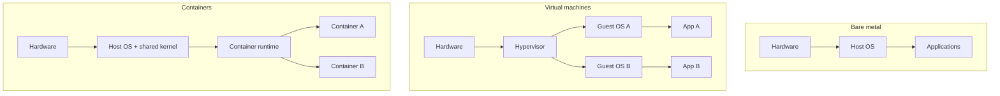

**Created:** *11.08.26, 12:00*

**Note Type:** #atomic

**Hashtags:**
- **Relevance Tags:**
	- #docker #containers
- **Topic Tags:**
	- #bare #metal #virtual

**Links / Tags:**
- **Relevance Links:**
	- Introduction to Docker %% Parent; plain text prevents a child-to-parent graph edge %%
- **Topic Links:**
	-

---

# Bare Metal vs Virtual Machines vs Containers

> Three deployment models with different isolation, density, and operational trade-offs.

## Key Ideas

- Bare metal runs directly on hardware and offers maximum control, but environments are harder to reproduce.
- A virtual machine includes a guest kernel and offers a strong machine boundary at a higher resource cost.
- A container shares a kernel and isolates processes, so it is lighter and starts faster, but its isolation model differs from a VM.
- Containers and VMs are often combined: containers run inside virtual machines in cloud platforms.

## Deep Dive
## Architecture Comparison

| Property | Bare metal | VM | Container |
|---|---|---|---|
| Isolation boundary | Process/OS controls | Virtual hardware + guest kernel | Namespaced processes sharing a kernel |
| Startup | Application startup | Guest OS plus application | Usually application startup |
| Density | Lowest flexibility | Moderate | Usually highest |
| Different guest kernel | No | Yes | No for normal Linux containers |
| Packaging unit | Host installation | VM image | OCI image |

Use VMs when separate kernels or a strong machine boundary are required. Use containers for standardised application packaging and high-density process isolation. In practice, cloud systems commonly place containers inside VMs: the two technologies solve different layers of the problem.

## Practical Check

- Explain **Bare Metal vs Virtual Machines vs Containers** in your own words and identify one situation where it matters in a real container workflow.

---

# Related Notes
> Things you might want to think about alongside this note, but not because of it

---
# References
- [Docker documentation](https://docs.docker.com/)
