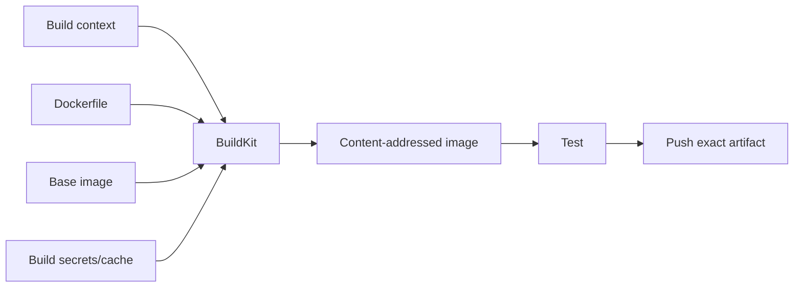

**Created:** *11.08.26, 12:00*

**Note Type:** #map

**Hashtags:**
- **Relevance Tags:**
	- #docker #containers #mapofcontent
- **Topic Tags:**
	- #building #container #images

**Links / Tags:**
- **Relevance Links:**
	- Docker %% Parent; plain text prevents a child-to-parent graph edge %%
- **Topic Links:**
	- [[Dockerfiles]]
	- [[Efficient Docker Layer Caching]]
	- [[Docker Image Size and Security]]

---

# Building Container Images

> Creating repeatable application images from source and a Dockerfile.

## Key Ideas

- Keep the build context small, order instructions for cache reuse, and use multi-stage builds.
- Rebuild instead of modifying running containers.
- Treat build inputs and base images as part of the software supply chain.

## Learning Path

- [[Dockerfiles]]
	- A declarative recipe that BuildKit uses to construct an image.
- [[Efficient Docker Layer Caching]]
	- Structuring builds so unchanged expensive steps can reuse cached results.
- [[Docker Image Size and Security]]
	- Reducing shipped content also reduces transfer time and often the attack surface.

## Deep Dive
## Build as a Directed Dependency Graph

The build context is the set of files available to `COPY`/`ADD`; it is not automatically the whole machine. `.dockerignore` reduces transfer, prevents irrelevant cache invalidation, and helps keep secrets out—but secret handling should use BuildKit secret mounts, not merely hope files are ignored.

### Reproducibility spectrum

- A floating base tag plus unpinned package install is convenient but changes over time.
- A versioned base and locked application dependencies are more reproducible.
- A digest-pinned base is exact but requires an intentional update process.

Build once in CI, test that image, record its digest, and promote the same content. Rebuilding “the same commit” later can resolve different external dependencies.

## Practical Check

- Explain how each child topic contributes to this part of the Docker workflow, then follow the links in order.

---

# Related Notes
> Things you might want to think about alongside this note, but not because of it

---
# References
- [Docker build overview](https://docs.docker.com/build/concepts/overview/)
