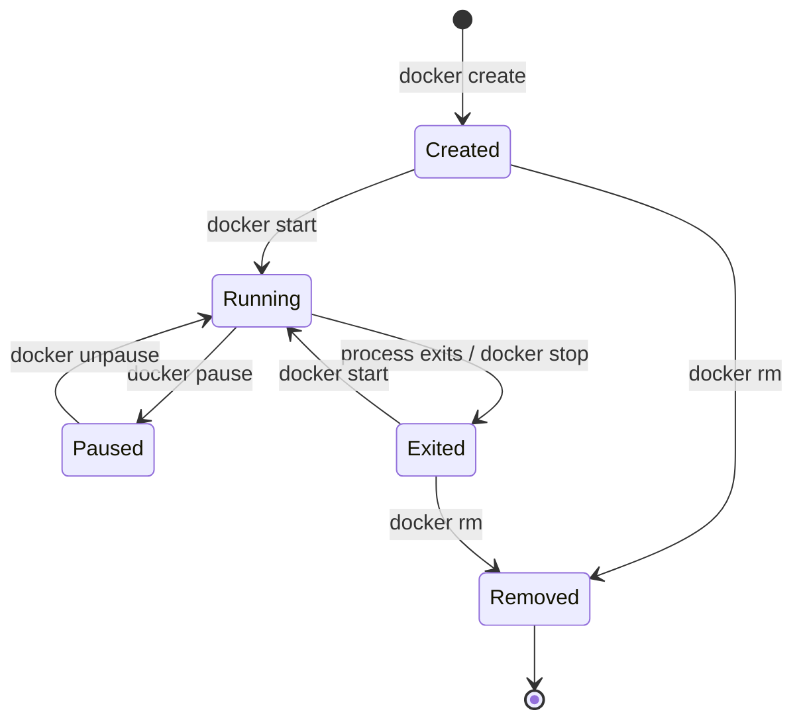

**Created:** *11.08.26, 12:00*

**Note Type:** #atomic

**Hashtags:**
- **Relevance Tags:**
	- #docker #containers
- **Topic Tags:**
	- #container #lifecycle

**Links / Tags:**
- **Relevance Links:**
	- Docker Basics %% Parent; plain text prevents a child-to-parent graph edge %%
- **Topic Links:**
	-

---

# Container Lifecycle

> The states and transitions of a Docker container from creation to removal.

## Key Ideas

- `docker create` prepares a stopped container; `docker start` launches its configured process.
- `docker run` combines pull-if-needed, create, and start.
- `docker stop` requests graceful termination and later forces termination if needed; `docker kill` sends a signal immediately.
- `docker rm` removes the container, while restart policies can bring stopped workloads back after failures.

## Deep Dive
## State Machine

`docker run` is a convenience operation: pull if required, create, then start and optionally attach. A stopped container still consumes metadata and writable-layer disk. `--rm` asks Docker to remove it automatically after exit and is ideal for disposable tasks.

### Graceful shutdown

`docker stop` sends the configured stop signal—normally `SIGTERM` on Linux—then waits before forcing termination. The application should stop accepting work, finish or reject in-flight operations, flush state, and exit. Shell-form commands can interfere with signal delivery; exec-form Dockerfile commands are safer.

### Restart policies

Restart policies react to process/daemon lifecycle, but they do not make a broken application healthy. Combine them with correct exit behaviour, health signals, bounded retries in dependencies, and observability.

## Practical Check

- Explain **Container Lifecycle** in your own words and identify one situation where it matters in a real container workflow.

---

# Related Notes
> Things you might want to think about alongside this note, but not because of it

- [[Ephemeral Container Filesystem]] %% Conceptual overlap; intentionally reciprocal %%

- [[Debugging Containers]] %% Conceptual overlap; intentionally reciprocal %%

---
# References
- [Docker documentation](https://docs.docker.com/)
