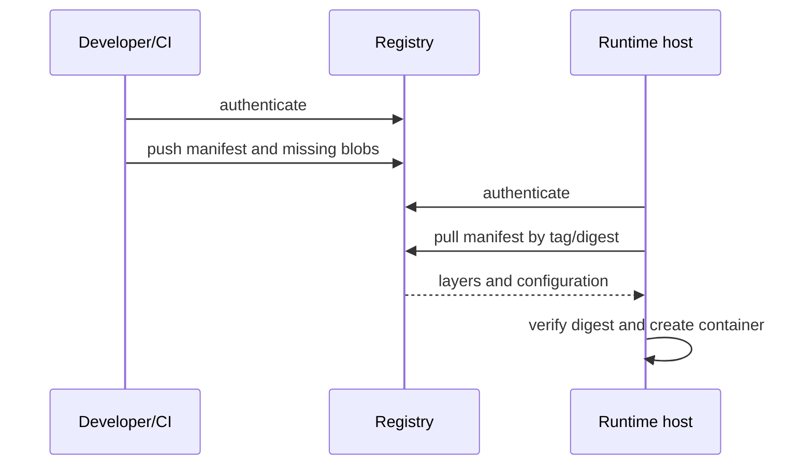

**Created:** *11.08.26, 12:00*

**Note Type:** #map

**Hashtags:**
- **Relevance Tags:**
	- #docker #containers #mapofcontent
- **Topic Tags:**
	- #container #registries

**Links / Tags:**
- **Relevance Links:**
	- Docker %% Parent; plain text prevents a child-to-parent graph edge %%
- **Topic Links:**
	- [[Docker Hub]]
	- [[Other Container Registries]]
	- [[Docker Image Tagging Best Practices]]

---

# Container Registries

> Services that store and distribute versioned container images.

## Key Ideas

- Images are pushed to repositories and selected by tags or immutable digests.
- Authentication controls push/pull access; retention, replication, and scanning depend on the registry.
- Use least-privilege credentials in local development and CI.

## Learning Path

- [[Docker Hub]]
	- Docker’s public registry and ecosystem for official, verified, community, and private image repositories.
- [[Other Container Registries]]
	- OCI-compatible alternatives such as GitHub Container Registry, Amazon ECR, Google Artifact Registry, Azure Container Registry, and self-hosted registries.
- [[Docker Image Tagging Best Practices]]
	- Using human-friendly tags while retaining an immutable identity for reliable deployment.

## Deep Dive
## Distribution Model

Registries store content-addressed blobs and manifests. Repositories organise related image references. Tags point to manifests; digest references select immutable content.

### Operational questions

- Who may pull, push, delete, or retag?
- Are credentials short-lived and scoped?
- Are vulnerability scans blocking, advisory, or absent?
- How long are untagged manifests retained?
- Is cross-region replication required?
- How are signatures, attestations, and SBOMs stored or verified?

A local `docker login` writes credential configuration through the configured credential store or config file. CI should use the platform’s secret mechanism and log in non-interactively without printing tokens.

## Practical Check

- Explain how each child topic contributes to this part of the Docker workflow, then follow the links in order.

---

# Related Notes
> Things you might want to think about alongside this note, but not because of it

---
# References
- [Registry overview](https://docs.docker.com/get-started/docker-concepts/the-basics/what-is-a-registry/)
