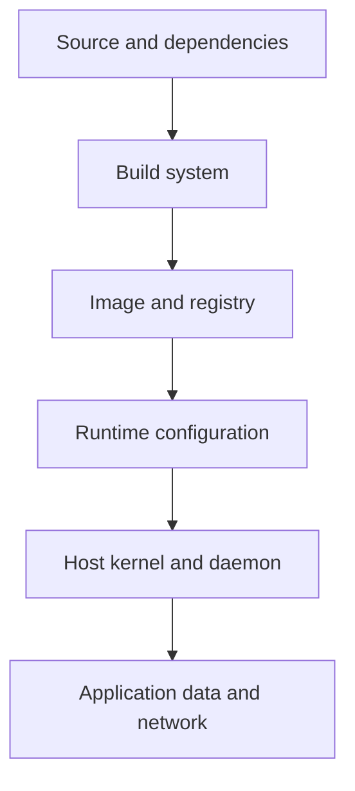

**Created:** *11.08.26, 12:00*

**Note Type:** #map

**Hashtags:**
- **Relevance Tags:**
	- #docker #containers #mapofcontent
- **Topic Tags:**
	- #container #security

**Links / Tags:**
- **Relevance Links:**
	- Docker %% Parent; plain text prevents a child-to-parent graph edge %%
- **Topic Links:**
	- [[Docker Image Security]]
	- [[Docker Runtime Security]]

---

# Container Security

> Reducing risk across image supply, daemon access, runtime isolation, secrets, networks, and host resources.

## Key Ideas

- Containers are not automatically trusted or harmless.
- Apply least privilege, scan and update images, protect the daemon socket, and limit host integration.
- Security is layered: build-time controls and runtime controls address different risks.

## Learning Path

- [[Docker Image Security]]
	- Protecting the software supply chain and reducing vulnerabilities before a container starts.
- [[Docker Runtime Security]]
	- Restricting what a running container and its processes can do.

## Deep Dive
## Threat Model by Layer

Security failure at any layer can compromise the workload. Scanning an image does not protect an exposed Docker socket; a non-root process does not make a malicious dependency trustworthy.

### Baseline controls

- Trust and pin inputs; rebuild patched images regularly.
- Keep credentials out of image layers, source, Compose output, and logs.
- Run as a non-root user; drop capabilities and avoid privileged mode.
- Mount only required paths, preferably read-only.
- Publish only necessary ports and segment networks.
- Set resource/PID limits to reduce denial-of-service impact.
- Protect daemon access as host administration.
- Collect logs and know which exact digest is running.

Containers reduce and structure risk; they are not a sandbox guarantee for hostile code. Use stronger isolation where the threat model requires it.

## Practical Check

- Explain how each child topic contributes to this part of the Docker workflow, then follow the links in order.

---

# Related Notes
> Things you might want to think about alongside this note, but not because of it

---
# References
- [Docker security](https://docs.docker.com/security/)
- [Docker Engine security](https://docs.docker.com/engine/security/)
