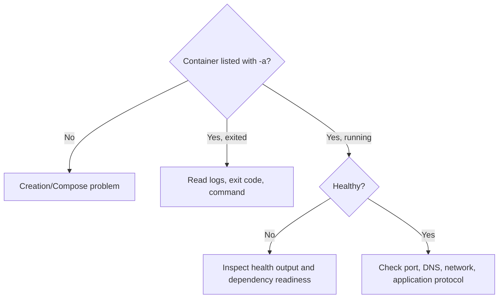

**Created:** *<span class ="color-green">11.08.26, 12:00</span>*

**Note Type:** #atomic

**Hashtags:**
- **Relevance Tags:**
	- #docker #containers
- **Topic Tags:**
	- #debugging #containers

**Links / Tags:**
- **Relevance Links:**
	- Docker Developer Experience %% Parent; plain text prevents a child-to-parent graph edge %%
- **Topic Links:**
	-

---

# Debugging Containers

> A systematic workflow for understanding failed builds, starts, health checks, networking, and application behaviour.

## Key Ideas

- Begin with `docker ps -a`, `docker logs`, and `docker inspect`.
- Use `docker exec -it NAME sh` only when the image contains a shell and the container stays running.
- Inspect exit codes, effective command, environment, mounts, network membership, DNS, and published ports.
- Minimal images may require a separate diagnostic container rather than installing tools into production.

## Example

```bash
docker container ls -a
docker logs --tail 100 my-container
docker inspect my-container
docker exec -it my-container sh
```

## Deep Dive
## Diagnose by Layer



### High-signal checklist

1. `docker compose config` — is the intended configuration actually rendered?
2. `docker ps -a` — did the container exist and exit?
3. `docker inspect` — command, user, state, mounts, health, network, OOM status.
4. `docker logs` — application stdout/stderr and timestamps.
5. Test from the correct location: host-to-published-port differs from container-to-service-name.
6. Check filesystem ownership and whether a mount hides expected files.
7. Reproduce with a minimal command and versioned image.

Exit code 0 usually means the main process finished successfully, not that Docker failed. A server container stops when its server process daemonises or a wrapper exits. Keep the main service in the foreground.

For minimal images, run a diagnostic image on the same network rather than modifying production:

```bash
docker run --rm --network project_default curlimages/curl:latest http://app:8080/health
```

## Practical Check

- Explain **Debugging Containers** in your own words and identify one situation where it matters in a real container workflow.

---

# Related Notes
> Things you might want to think about alongside this note, but not because of it


- [[Container Lifecycle]] %% Conceptual overlap; intentionally reciprocal %%

- [[Docker Networking]] %% Conceptual overlap; intentionally reciprocal %%

- [[Docker Troubleshooting Playbook]] %% Conceptual overlap; intentionally reciprocal %%

---
# References
- [Docker documentation](https://docs.docker.com/)
