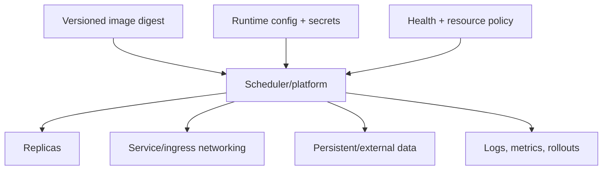

**Created:** *11.08.26, 12:00*

**Note Type:** #map

**Hashtags:**
- **Relevance Tags:**
	- #docker #containers #mapofcontent
- **Topic Tags:**
	- #deploying #containers

**Links / Tags:**
- **Relevance Links:**
	- Docker %% Parent; plain text prevents a child-to-parent graph edge %%
- **Topic Links:**
	- [[Docker Swarm]]
	- [[Kubernetes for Docker Users]]
	- [[Nomad for Container Deployment]]
	- [[PaaS Container Deployment Options]]

---

# Deploying Containers

> Running containerised workloads reliably beyond one developer machine.

## Key Ideas

- A deployment platform schedules workloads, handles desired state, networking, secrets, updates, and recovery.
- Docker images are portable artifacts, but platform configuration and operational responsibilities still differ.
- Choose the simplest platform that meets availability, scale, compliance, and team-operability needs.

## Learning Path

- [[Docker Swarm]]
	- Docker Engine’s built-in cluster orchestration mode for services across multiple nodes.
- [[Kubernetes for Docker Users]]
	- A container orchestration platform that schedules OCI containers using declarative resources.
- [[Nomad for Container Deployment]]
	- HashiCorp Nomad is a scheduler that can run container and non-container workloads.
- [[PaaS Container Deployment Options]]
	- Managed platforms that deploy an image or source with less infrastructure management.

## Deep Dive
## From `docker run` to a Platform Contract

A deployment platform adds desired state: if a process or node fails, it can schedule a replacement. This works only when the application supports replacement—externalised state, graceful shutdown, readiness checks, idempotent startup, and compatible schema migrations.

### Deployment readiness checklist

- Image pinned by digest and available for every required CPU architecture.
- Non-secret configuration and secret injection defined.
- Resource requests/limits measured.
- Health/readiness and termination behaviour tested.
- Persistent data, backups, and migrations designed.
- Only required network paths exposed.
- Logs/metrics/traces available outside the container.
- Rolling update and rollback strategy documented.

Do not choose Kubernetes solely because it is popular. Operational capability, workload count, availability needs, compliance, and team experience should drive the platform.

## Practical Check

- Explain how each child topic contributes to this part of the Docker workflow, then follow the links in order.

---

# Related Notes
> Things you might want to think about alongside this note, but not because of it

---
# References
- [Docker Swarm mode](https://docs.docker.com/engine/swarm/)
- [Kubernetes documentation](https://kubernetes.io/docs/home/)
