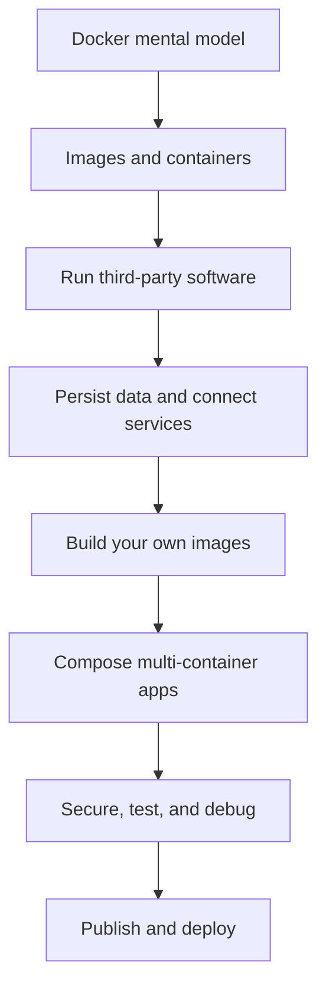

**Created:** *11.08.26, 01:49*

**Note Type:** #map

**Hashtags:**
- **Relevance Tags:**
	- #docker #containers #mapofcontent
- **Topic Tags:**
	- #docker

**Links / Tags:**
- **Relevance Links:**
	- Containerisation
	
- **Topic Links:**
	- [[Introduction to Docker]]
	- [[Docker Underlying Technologies]]
	- [[Docker Installation and Setup]]
	- [[Docker Basics]]
	- [[Docker Data Persistence]]
	- [[Using Third-Party Container Images]]
	- [[Building Container Images]]
	- [[Container Registries]]
	- [[Running Containers]]
	- [[Docker CLI]]
	- [[Docker Networking]]
	- [[Container Security]]
	- [[Docker Developer Experience]]
	- [[Deploying Containers]]
	- [[Docker Guided Learning Path]]
	- [[Docker Capstone Project]]
	- [[Docker Troubleshooting Playbook]]
	- [[Docker Glossary]]

---

# Docker

> A platform and workflow for packaging an application with its dependencies into images and running those images as isolated containers.

## Key Ideas

- Learn the container mental model before memorising commands.
- Build immutable images, supply configuration at runtime, and keep important data outside the container layer.
- Use the CLI for individual resources and Compose for a multi-container application.

## Learning Path

- [[Introduction to Docker]]
	- The ideas and trade-offs that explain what Docker is and where containers fit.
- [[Docker Underlying Technologies]]
	- The Linux mechanisms that make process isolation, resource control, and layered images possible.
- [[Docker Installation and Setup]]
	- Choose Docker Desktop for an integrated workstation experience or Docker Engine directly on a supported Linux host.
- [[Docker Basics]]
	- The core objects and lifecycle required for everyday Docker use.
- [[Docker Data Persistence]]
	- Ways to keep or share data independently of a disposable container writable layer.
- [[Using Third-Party Container Images]]
	- Using trusted published images instead of building every dependency from scratch.
- [[Building Container Images]]
	- Creating repeatable application images from source and a Dockerfile.
- [[Container Registries]]
	- Services that store and distribute versioned container images.
- [[Running Containers]]
	- Creating containers from images with the configuration needed by a workload.
- [[Docker CLI]]
	- The command-line interface for managing Docker objects through the Engine API.
- [[Docker Networking]]
	- How containers communicate with each other, the host, and external services.
- [[Container Security]]
	- Reducing risk across image supply, daemon access, runtime isolation, secrets, networks, and host resources.
- [[Docker Developer Experience]]
	- Using containers to make local feedback loops, debugging, tests, and automation consistent.
- [[Deploying Containers]]
	- Running containerised workloads reliably beyond one developer machine.
- [[Docker Guided Learning Path]]
	- A staged order for studying this vault and checking understanding.
- [[Docker Capstone Project]]
	- A practical project that combines images, Compose, storage, networks, security, testing, and publishing.
- [[Docker Troubleshooting Playbook]]
	- A symptom-driven diagnostic workflow for common Docker failures.
- [[Docker Glossary]]
	- Compact definitions for the vocabulary used throughout the course.

## Deep Dive
## How to Use This Vault

This vault is organised as a course rather than an alphabetical reference. Follow the **Learning Path** from top to bottom on the first pass. On later passes, use the reciprocal links in **Related Notes** to connect ideas that affect one another.

### The four questions behind almost every Docker task

1. **What filesystem should the process start with?** The image answers this.
2. **What should the process do when it starts?** `ENTRYPOINT`, `CMD`, or runtime arguments answer this.
3. **What must be supplied from outside?** Environment variables, secrets, mounts, networks, and resource limits answer this.
4. **What must survive replacement?** Volumes, external databases, and object storage answer this.

### One-sentence mental model

> Build an immutable image once, create replaceable containers from it, inject environment-specific configuration at runtime, and store durable state outside the container.

## Course Outcomes

After completing the notes and labs, you should be able to:

- explain containers without calling them “lightweight VMs”;
- run and inspect unfamiliar images safely;
- write cache-efficient, multi-stage Dockerfiles;
- model a multi-service development environment with Compose;
- distinguish image data, writable layers, volumes, and bind mounts;
- diagnose command, process, filesystem, DNS, port, and permission failures;
- apply least privilege and basic supply-chain controls;
- publish a versioned image and reason about deployment-platform choices.

## Practical Check

- Explain how each child topic contributes to this part of the Docker workflow, then follow the links in order.

---

# Related Notes
> Things you might want to think about alongside this note, but not because of it

---
# References
- [Docker documentation](https://docs.docker.com/)
- [Docker get started](https://docs.docker.com/get-started/)
