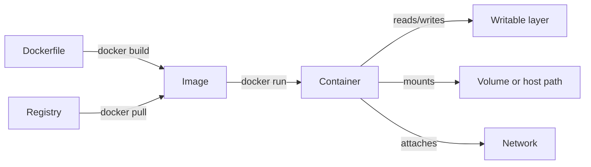

**Created:** *<span class ="color-green">11.08.26, 12:00</span>*

**Note Type:** #map

**Hashtags:**
- **Relevance Tags:**
	- #docker #containers #mapofcontent
- **Topic Tags:**
	- #basics

**Links / Tags:**
- **Relevance Links:**
	- Docker %% Parent; plain text prevents a child-to-parent graph edge %%
- **Topic Links:**
	- [[Docker Images]]
	- [[Docker Containers]]
	- [[Container Lifecycle]]

---

# Docker Basics

> The core objects and lifecycle required for everyday Docker use.

## Key Ideas

- An image is an immutable template; a container is a runtime instance with configuration and a writable layer.
- Learn create, start, stop, inspect, remove, pull, and build before advanced orchestration.

## Learning Path

- [[Docker Images]]
	- An immutable, content-addressed package containing filesystem layers and metadata needed to create a container.
- [[Docker Containers]]
	- A runnable instance of an image plus runtime configuration and a writable filesystem layer.
- [[Container Lifecycle]]
	- The states and transitions of a Docker container from creation to removal.

## Deep Dive
## The Core Object Model



The most common beginner confusion comes from mixing object lifecycles. Removing a container does not normally remove its image. Removing an image does not remove registry content. Removing a container does not remove a named volume unless explicitly requested. Stopping is not removing; rebuilding an image does not update an already-created container.

### First controlled experiment

```bash
docker pull alpine:3.21
docker run --name basics alpine:3.21 sh -c 'echo hello > /message && cat /message'
docker ps -a
docker start -a basics       # same container: /message remains
docker rm basics
docker run --rm alpine:3.21 sh -c 'test -e /message || echo fresh container'
```

This demonstrates the difference between re-starting one container and creating a new container from the same image.

## Practical Check

- Explain how each child topic contributes to this part of the Docker workflow, then follow the links in order.

---

# Related Notes
> Things you might want to think about alongside this note, but not because of it


---
# References
- [Docker documentation](https://docs.docker.com/)
