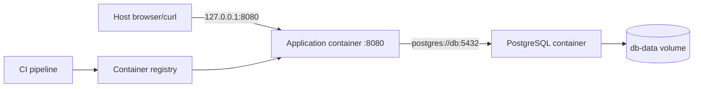

**Created:** *<span class ="color-green">11.08.26, 12:00</span>*

**Note Type:** #atomic

**Hashtags:**
- **Relevance Tags:**
	- #docker #containers #project
- **Topic Tags:**
	- #compose #dockerfile #practice

**Links / Tags:**
- **Relevance Links:**
	- Docker %% Parent; plain text prevents a child-to-parent graph edge %%
- **Topic Links:**
	-

---

# Docker Capstone Project

> Containerise a small HTTP application with PostgreSQL, then test, secure, publish, and prepare it for deployment.

## Target Architecture



The application language is your choice. It must provide `/health`, read its database connection from runtime configuration, log to stdout/stderr, handle termination, and listen on `0.0.0.0`.

## Milestone 1 — Build

Create a `.dockerignore` and multi-stage `Dockerfile`:

- dependency manifests are copied before frequently changing source;
- build/test tooling stays out of the final stage;
- the runtime process uses a non-root user;
- `ENTRYPOINT`/`CMD` use exec form;
- no credential enters the image;
- a versioned, maintained base is used.

```bash
docker build --pull -t capstone-app:dev .
docker image history capstone-app:dev
docker run --rm capstone-app:dev
```

Document why the last command succeeds or fails without database configuration.

## Milestone 2 — Compose

Write `compose.yaml` with:

- `app` built from the Dockerfile;
- version-pinned PostgreSQL image;
- `db-data` named volume;
- database health check;
- application port bound to `127.0.0.1`;
- database not published to the host unless a host-side client is required;
- secret file or appropriate local secret injection for the password;
- explicit restart behaviour only after understanding failure semantics.

Run:

```bash
docker compose config
docker compose up --build -d
docker compose ps
docker compose logs -f app
```

Verify that the application connects to `db:5432`, not `localhost` and not the published host port.

## Milestone 3 — Persistence Experiment

1. Create data through the application.
2. Run `docker compose down` and then `up -d`.
3. Confirm the data remains.
4. Export a database-native backup.
5. Run `docker compose down --volumes` only after confirming the backup.
6. Recreate and restore the data.

Explain why persistence and backup are separate guarantees.

## Milestone 4 — Failure Drills

Introduce and diagnose each fault without random changes:

- wrong service hostname;
- application bound to `127.0.0.1` inside its container;
- host port collision;
- missing environment variable;
- read-only or wrong-ownership mounted directory;
- database not ready when the application first connects;
- main process exits with code 0 immediately.

Record the evidence from `docker compose config`, `ps -a`, `logs`, and `inspect` that identified each cause.

## Milestone 5 — Security and Resource Pass

- Confirm the final image’s configured user is non-root.
- Try a read-only root filesystem and supply only necessary writable paths.
- Drop unnecessary capabilities.
- Add reasonable memory, CPU, and PID constraints; test under load.
- Scan the image and distinguish actionable runtime findings from irrelevant build-stage content.
- Review every mount and published port.

## Milestone 6 — Publish the Artifact

```bash
docker tag capstone-app:dev registry.example.com/you/capstone:1.0.0
docker push registry.example.com/you/capstone:1.0.0
docker image inspect registry.example.com/you/capstone:1.0.0 --format '{{index .RepoDigests 0}}'
```

Record the digest. A deployment design should refer to that exact artifact, inject environment-specific configuration, provide health/readiness behaviour, collect logs, and define rollback.

## Completion Standard

The project is complete when another developer can clone it, provide documented local secrets, run one Compose command, observe healthy services, execute tests, destroy/recreate containers without data loss, restore from backup, and identify the exact image digest intended for deployment.

---

# Related Notes
> Things you might want to think about alongside this note, but not because of it

- [[Docker Guided Learning Path]] %% Course practice overlap; intentionally reciprocal %%
- [[Docker in Continuous Integration]] %% Release-workflow overlap; intentionally reciprocal %%

---
# References
- [Docker workshop](https://docs.docker.com/get-started/workshop/)
- [Docker build best practices](https://docs.docker.com/build/building/best-practices/)
