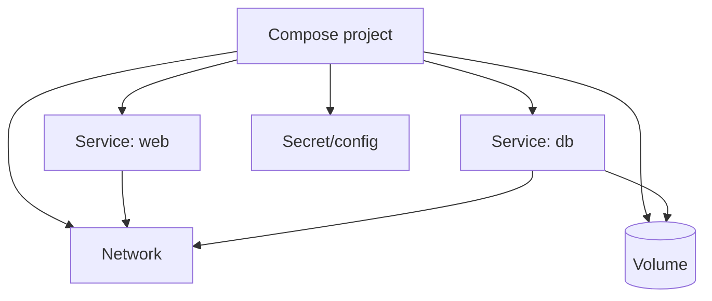

**Created:** *<span class ="color-green">11.08.26, 12:00</span>*

**Note Type:** #atomic

**Hashtags:**
- **Relevance Tags:**
	- #docker #containers
- **Topic Tags:**
	- #compose

**Links / Tags:**
- **Relevance Links:**
	- Running Containers %% Parent; plain text prevents a child-to-parent graph edge %%
- **Topic Links:**
	-

---

# Docker Compose

> A declarative way to define and operate a multi-container application in a YAML file.

## Key Ideas

- Top-level concepts include services, networks, volumes, configs, and secrets.
- `docker compose up -d` reconciles and starts the project; `logs`, `ps`, `exec`, and `down` manage it.
- Services on the default Compose network discover one another by service name.
- Review untrusted Compose files: they can request host mounts, privileges, devices, and host-level access.

## Example

```yaml
services:
  app:
    build: .
    ports:
      - "127.0.0.1:8080:8080"
    environment:
      DATABASE_URL: postgres://app@db/app
    depends_on:
      - db
  db:
    image: postgres:17
    volumes:
      - db-data:/var/lib/postgresql/data
volumes:
  db-data:
```

## Deep Dive
## Compose Application Model



A **service** is a desired container configuration, not necessarily one permanent container. Compose can recreate its container while retaining the service name and declared volume.

### Daily workflow

```bash
docker compose config          # render and validate merged configuration
docker compose up --build -d   # build if needed and reconcile services
docker compose ps
docker compose logs -f app
docker compose exec app sh
docker compose down            # remove project containers/network
docker compose down --volumes  # also delete declared volumes: destructive
```

### Configuration details

- Variable interpolation in YAML is different from environment variables passed into containers. Inspect `docker compose config` to see the resolved model.
- `depends_on` expresses ordering/dependency metadata; it does not make every dependency protocol ready unless suitable health conditions and checks are configured.
- Services reach one another by service name and **container** port. Published host ports serve host/external clients.
- Profiles and override files can model optional development tools, but excessive layering makes the effective configuration hard to understand.

Treat an unknown Compose file as executable infrastructure. Review resolved mounts, privileges, devices, build contexts, secrets, and network modes before `up`.

## Practical Check

- Explain **Docker Compose** in your own words and identify one situation where it matters in a real container workflow.

---

# Related Notes
> Things you might want to think about alongside this note, but not because of it

- [[Docker DNS and Service Discovery]] %% Conceptual overlap; intentionally reciprocal %%

- [[Docker Volumes]] %% Conceptual overlap; intentionally reciprocal %%

---
# References
- [Docker Compose](https://docs.docker.com/compose/)
- [Compose file reference](https://docs.docker.com/reference/compose-file/)
