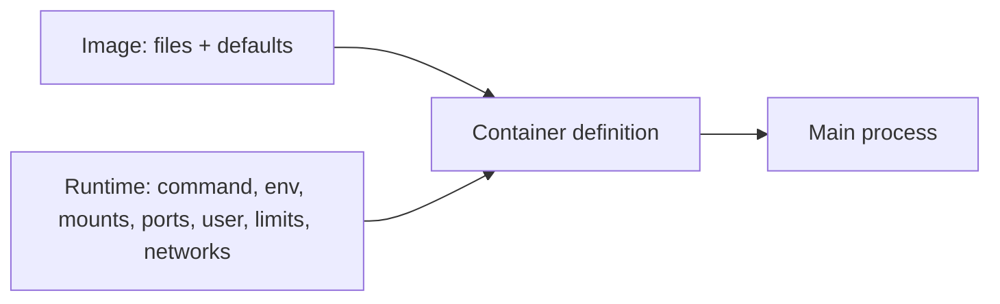

**Created:** *11.08.26, 12:00*

**Note Type:** #atomic

**Hashtags:**
- **Relevance Tags:**
	- #docker #containers
- **Topic Tags:**
	- #containers

**Links / Tags:**
- **Relevance Links:**
	- Docker Basics %% Parent; plain text prevents a child-to-parent graph edge %%
- **Topic Links:**
	-

---

# Docker Containers

> A runnable instance of an image plus runtime configuration and a writable filesystem layer.

## Key Ideas

- Multiple containers can be created independently from one image.
- The main process determines the container lifecycle; when PID 1 exits, the container stops.
- Environment variables, mounts, networks, ports, users, and limits are chosen when creating it.
- Treat containers as replaceable: rebuild the image or recreate the container instead of patching it manually.

## Deep Dive
## Image Configuration Plus Runtime Configuration

Creating a container combines two inputs:

Once created, the container remembers its configuration. `docker start` reuses it; it does not re-read a Compose file or accept a new port mapping. To change most creation-time settings, remove and recreate the container.

### Container identity

- ID: immutable engine-generated identifier.
- Name: human-friendly unique name on that engine.
- Hostname: name visible inside its UTS namespace; not the same as Docker object name in every situation.
- Labels: metadata used for automation, filtering, and ownership.

### Replace, do not repair

`docker exec` is useful for observation and temporary diagnostics. Installing packages or editing code inside a running container creates an undocumented snowflake. Put permanent changes in the Dockerfile, configuration, or mounted data, then recreate the container.

## Practical Check

- Explain **Docker Containers** in your own words and identify one situation where it matters in a real container workflow.

---

# Related Notes
> Things you might want to think about alongside this note, but not because of it

- [[Docker Container Commands]] %% Conceptual overlap; intentionally reciprocal %%

- [[Docker Runtime Configuration Options]] %% Conceptual overlap; intentionally reciprocal %%

---
# References
- [Docker documentation](https://docs.docker.com/)
