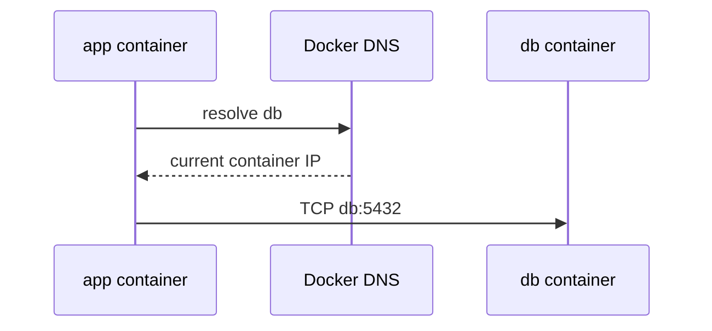

**Created:** *11.08.26, 12:00*

**Note Type:** #atomic

**Hashtags:**
- **Relevance Tags:**
	- #docker #containers
- **Topic Tags:**
	- #service #discovery

**Links / Tags:**
- **Relevance Links:**
	- Docker Networking %% Parent; plain text prevents a child-to-parent graph edge %%
- **Topic Links:**
	-

---

# Docker DNS and Service Discovery

> Name resolution supplied on user-defined Docker and Compose networks.

## Key Ideas

- Containers on a user-defined network can address peers by container or network alias.
- Compose services normally use stable service names even when container IP addresses change.
- Do not hard-code container IPs; containers are recreated and addresses are dynamic.
- DNS discovery does not imply readiness—clients still need retries or health-aware startup logic.

## Deep Dive
## Stable Names, Disposable Addresses

User-defined Docker networks include embedded DNS. Compose registers service names, so an application connects to `db:5432`, not to an IP copied from `docker inspect`.

Recreating `db` can change its IP while retaining the service name. Existing TCP connections to the old container still break; clients must reconnect and resolve again.

DNS success is not application readiness. A name may resolve before the database accepts connections. Use bounded retries with backoff, meaningful health checks, and idempotent startup/migrations.

Inside a container, `localhost` always means its own network namespace. Using `localhost` to reach a sibling service is one of the most common beginner errors.

## Practical Check

- Explain **Docker DNS and Service Discovery** in your own words and identify one situation where it matters in a real container workflow.

---

# Related Notes
> Things you might want to think about alongside this note, but not because of it

- [[Docker Compose]] %% Conceptual overlap; intentionally reciprocal %%

---
# References
- [Docker documentation](https://docs.docker.com/)
