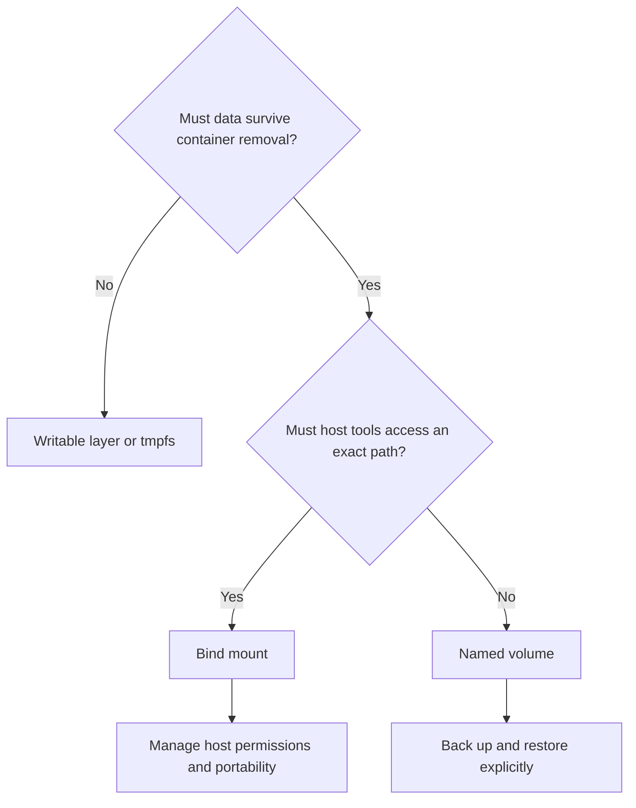

**Created:** *11.08.26, 12:00*

**Note Type:** #map

**Hashtags:**
- **Relevance Tags:**
	- #docker #containers #mapofcontent
- **Topic Tags:**
	- #data #persistence

**Links / Tags:**
- **Relevance Links:**
	- Docker %% Parent; plain text prevents a child-to-parent graph edge %%
- **Topic Links:**
	- [[Ephemeral Container Filesystem]]
	- [[Docker Volumes]]
	- [[Docker Bind Mounts]]

---

# Docker Data Persistence

> Ways to keep or share data independently of a disposable container writable layer.

## Key Ideas

- Prefer named volumes for Docker-managed application data.
- Use bind mounts when an exact host path must be visible inside the container.
- Choose ownership, backup, restore, and lifecycle policies deliberately.

## Learning Path

- [[Ephemeral Container Filesystem]]
	- The default writable layer exists only as part of one container and should be treated as temporary.
- [[Docker Volumes]]
	- Docker-managed storage that persists independently of any single container.
- [[Docker Bind Mounts]]
	- A mapping from a specific host file or directory into a container.

## Deep Dive
## Choose Storage by Ownership and Lifetime

| Storage | Managed by | Survives container removal | Typical use |
|---|---|---|---|
| Writable layer | Container lifecycle | No | Temporary application output |
| Named volume | Docker | Yes | Databases and durable application data |
| Bind mount | Host/user | Yes | Source code and host-managed configuration |
| tmpfs | Memory | No | Sensitive or high-speed temporary data |

Mounting over a non-empty path hides the image’s files at that path while the mount is attached. This often explains “my application files disappeared” reports. Inspect the `Mounts` section of `docker inspect` before assuming image corruption.

Persistence is not a backup. A volume can faithfully persist accidental deletion or corruption. Define backup consistency, retention, restore testing, ownership, and migration procedures separately.

## Practical Check

- Explain how each child topic contributes to this part of the Docker workflow, then follow the links in order.

---

# Related Notes
> Things you might want to think about alongside this note, but not because of it

---
# References
- [Docker storage](https://docs.docker.com/engine/storage/)
