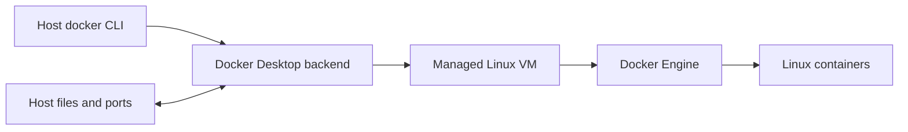

**Created:** *11.08.26, 12:00*

**Note Type:** #atomic

**Hashtags:**
- **Relevance Tags:**
	- #docker #containers
- **Topic Tags:**
	- #desktop

**Links / Tags:**
- **Relevance Links:**
	- Docker Installation and Setup %% Parent; plain text prevents a child-to-parent graph edge %%
- **Topic Links:**
	-

---

# Docker Desktop

> The packaged Docker development environment for macOS, Windows, and Linux.

## Key Ideas

- On macOS and Windows, Linux containers run inside a managed Linux virtual machine.
- Desktop bundles Docker Engine, the CLI, Compose, BuildKit tooling, and a graphical dashboard.
- Resource, file-sharing, proxy, and networking settings live in Desktop preferences.
- Production servers normally use an engine or orchestration platform rather than the Desktop application.

## Deep Dive
## What Desktop Adds

Docker Desktop is more than a GUI. On macOS and Windows it manages the Linux VM required for Linux containers, exposes file sharing and port forwarding between host and VM, bundles Compose and BuildKit, and supplies update/settings integration.

### Beginner traps

- `localhost` inside a container refers to that container, not the laptop. Use another service’s Docker DNS name, or the Desktop-supported host gateway name when reaching the host.
- Bind-mount performance and file-event behaviour can differ because files cross the host/VM boundary.
- Memory/CPU limits in Desktop settings constrain the VM as a whole; container limits operate inside it.
- A path may need to be permitted by Desktop file-sharing settings.

Use `docker context ls` when commands target an unexpected engine, and review licensing/organisation policy before standardising Desktop in a company.

## Practical Check

- Explain **Docker Desktop** in your own words and identify one situation where it matters in a real container workflow.

---

# Related Notes
> Things you might want to think about alongside this note, but not because of it

---
# References
- [Docker documentation](https://docs.docker.com/)
