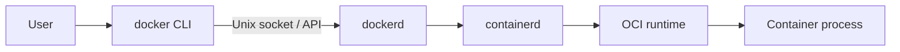

**Created:** *11.08.26, 12:00*

**Note Type:** #atomic

**Hashtags:**
- **Relevance Tags:**
	- #docker #containers
- **Topic Tags:**
	- #engine #linux

**Links / Tags:**
- **Relevance Links:**
	- Docker Installation and Setup %% Parent; plain text prevents a child-to-parent graph edge %%
- **Topic Links:**
	-

---

# Docker Engine on Linux

> The client-server runtime commonly used to build and run Docker containers directly on Linux.

## Key Ideas

- The `docker` client sends API requests to the Docker daemon.
- Install from Docker’s supported repository for your distribution and configure startup with the service manager.
- Membership in the `docker` group is effectively root-equivalent access to the daemon.
- Rootless mode reduces daemon privilege but has feature and networking trade-offs.

## Deep Dive
## Architecture and Privilege

The default Unix socket is commonly owned by root and a Docker group. Giving a user access to it normally allows actions equivalent to root—for example, starting a container with the host filesystem mounted. Treat group membership and remote API access as privileged administration decisions.

### Operational checklist

- Install from a trusted, supported package source.
- Enable and inspect the service with the distribution’s service manager.
- Keep the engine and host kernel patched.
- Do not expose an unauthenticated daemon TCP socket.
- Configure logging, disk usage, registry access, and firewall behaviour deliberately.
- Evaluate rootless mode where its limitations fit the workload.

When diagnosing, distinguish daemon logs from container logs. `journalctl -u docker` concerns the engine; `docker logs NAME` concerns a container’s configured stdout/stderr.

## Practical Check

- Explain **Docker Engine on Linux** in your own words and identify one situation where it matters in a real container workflow.

---

# Related Notes
> Things you might want to think about alongside this note, but not because of it

- [[Docker Runtime Security]] %% Conceptual overlap; intentionally reciprocal %%

---
# References
- [Docker documentation](https://docs.docker.com/)
