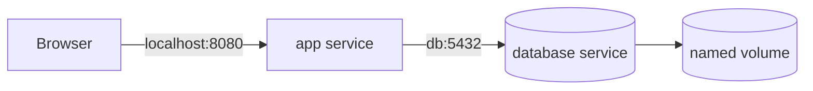

**Created:** *<span class ="color-green">11.08.26, 12:00</span>*

**Note Type:** #map

**Hashtags:**
- **Relevance Tags:**
	- #docker #containers #learningpath
- **Topic Tags:**
	- #curriculum #practice #roadmap

**Links / Tags:**
- **Relevance Links:**
	- Docker %% Parent; plain text prevents a child-to-parent graph edge %%
- **Topic Links:**
	-

---

# Docker Guided Learning Path

> A staged route from first principles to building and operating a realistic containerised application.

## Stage 1 — Build the Mental Model

Read:

1. **What Are Containers**
2. **Why We Need Containers**
3. **Bare Metal vs Virtual Machines vs Containers**
4. **Docker Images**
5. **Docker Containers**
6. **Container Lifecycle**

You are ready to continue when you can explain why an image is not a container, why stopping differs from removing, and why a container is better understood as an isolated process than a small VM.

### Lab

```bash
docker run --name learning alpine:3.21 sh -c 'echo first > /message'
docker start -a learning
docker inspect learning
docker rm learning
docker run --rm alpine:3.21 test ! -e /message
```

Predict the result of each command before running it.

## Stage 2 — Run Software Safely

Read:

1. **Using Third-Party Container Images**
2. **docker run**
3. **Docker Runtime Configuration Options**
4. **Docker Container Commands**
5. **Docker Image Commands**

Practice attached, detached, interactive, and disposable containers. Inspect image defaults before overriding them. Bind published development ports to `127.0.0.1`.

## Stage 3 — Understand State and Connectivity

Read:

1. **Ephemeral Container Filesystem**
2. **Docker Volumes**
3. **Docker Bind Mounts**
4. **Docker Networking**
5. **Docker Port Publishing**
6. **Docker DNS and Service Discovery**

You should be able to draw host → published port → container port and container → DNS service name → container port without mixing the paths.

## Stage 4 — Build Your Own Image

Read:

1. **Dockerfiles**
2. **Efficient Docker Layer Caching**
3. **Docker Image Size and Security**
4. **Docker Image Tagging Best Practices**
5. **Container Registries**

Build twice and observe which layers reuse cache. Change only application source, then only the lockfile, and explain why different layers rebuild.

## Stage 5 — Model an Application with Compose

Read **Docker Compose**, then create an application service and database service. Use a named volume for database data, a private network for service communication, a local-only published application port, a health check, and a non-secret configuration variable.



## Stage 6 — Make It Operable

Read:

1. **Debugging Containers**
2. **Testing with Docker**
3. **Container Security**
4. **Docker in Continuous Integration**
5. **Deploying Containers**

Complete **Docker Capstone Project** and use **Docker Troubleshooting Playbook** when a deliberately introduced fault occurs.

## Mastery Checklist

- [ ] I can inspect an unknown image before running it.
- [ ] I can predict container lifecycle and storage behaviour.
- [ ] I understand `ENTRYPOINT`, `CMD`, and runtime arguments.
- [ ] I can create a cache-efficient multi-stage Dockerfile.
- [ ] I can explain host ports versus container ports.
- [ ] I can model service discovery with Compose DNS.
- [ ] I can back up and restore persistent data safely.
- [ ] I can diagnose an exited or unreachable container systematically.
- [ ] I can explain why Docker-socket access is dangerous.
- [ ] I can publish and deploy an immutable image digest.

---

# Related Notes
> Things you might want to think about alongside this note, but not because of it

- [[Docker Capstone Project]] %% Course practice overlap; intentionally reciprocal %%

---
# References
- [Docker Get Started](https://docs.docker.com/get-started/)
