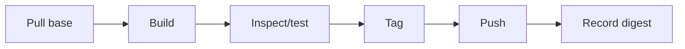

**Created:** *<span class ="color-green">11.08.26, 12:00</span>*

**Note Type:** #atomic

**Hashtags:**
- **Relevance Tags:**
	- #docker #containers
- **Topic Tags:**
	- #image #commands

**Links / Tags:**
- **Relevance Links:**
	- Docker CLI %% Parent; plain text prevents a child-to-parent graph edge %%
- **Topic Links:**
	-

---

# Docker Image Commands

> Commands that pull, build, inspect, tag, list, push, and remove images.

## Key Ideas

- Typical flow: `docker build -t app:dev .`, `docker image ls`, and `docker image inspect app:dev`.
- `docker pull NAME:TAG` downloads an image; `docker tag` adds another reference to the same image.
- `docker push` publishes a tagged image to its registry.
- Removing a tag does not necessarily delete shared layers still referenced elsewhere.

## Example

```bash
docker build -t example/app:dev .
docker image inspect example/app:dev
docker tag example/app:dev registry.example.com/example/app:1.0.0
docker push registry.example.com/example/app:1.0.0
```

## Deep Dive
## Image Workflow



Useful diagnostics:

```bash
docker image ls --digests
docker image inspect example/app:1.0
docker image history --no-trunc example/app:1.0
docker image rm example/app:old
```

An image can have multiple tags. Removing one tag may only remove that reference, not the underlying content. Docker removes unreferenced layers when safe; layers shared by other images remain.

`docker image prune` defaults to dangling content, while broader options can remove all unused images. “Unused” means not referenced by a container on that daemon, not “unimportant to you.” Understand re-pull cost and offline needs before cleanup.

## Practical Check

- Explain **Docker Image Commands** in your own words and identify one situation where it matters in a real container workflow.

---

# Related Notes
> Things you might want to think about alongside this note, but not because of it

- [[Docker Images]] %% Conceptual overlap; intentionally reciprocal %%

---
# References
- [Docker documentation](https://docs.docker.com/)
