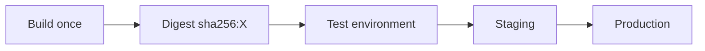

**Created:** *<span class ="color-green">11.08.26, 12:00</span>*

**Note Type:** #atomic

**Hashtags:**
- **Relevance Tags:**
	- #docker #containers
- **Topic Tags:**
	- #image #tagging #best

**Links / Tags:**
- **Relevance Links:**
	- Container Registries %% Parent; plain text prevents a child-to-parent graph edge %%
- **Topic Links:**
	-

---

# Docker Image Tagging Best Practices

> Using human-friendly tags while retaining an immutable identity for reliable deployment.

## Key Ideas

- Avoid relying on `latest`; it is only a conventional mutable tag.
- Use semantic versions, release identifiers, or source revision tags.
- Promote the same digest between environments instead of rebuilding it.
- For strongest repeatability, deploy `repository@sha256:digest` and record the associated readable tag.

## Deep Dive
## A Practical Tagging Scheme

One release can have several useful names:

```text
example/app:1.8.3       exact human release
example/app:1.8         movable patch channel
example/app:git-a1b2c3  source traceability
example/app:stable      environment/channel pointer
example/app@sha256:...  immutable content identity
```

Mutable channel tags are convenient for discovery but unsafe as the sole deployment record. Resolve and record the digest. Never rebuild and overwrite an immutable release tag in normal workflow; publish a new version.

### Promotion model



The same digest moves through environments. Configuration changes outside the image. This makes rollback and incident analysis much stronger than independently rebuilding per environment.

## Practical Check

- Explain **Docker Image Tagging Best Practices** in your own words and identify one situation where it matters in a real container workflow.

---

# Related Notes
> Things you might want to think about alongside this note, but not because of it


- [[Docker in Continuous Integration]] %% Conceptual overlap; intentionally reciprocal %%

---
# References
- [Docker documentation](https://docs.docker.com/)
