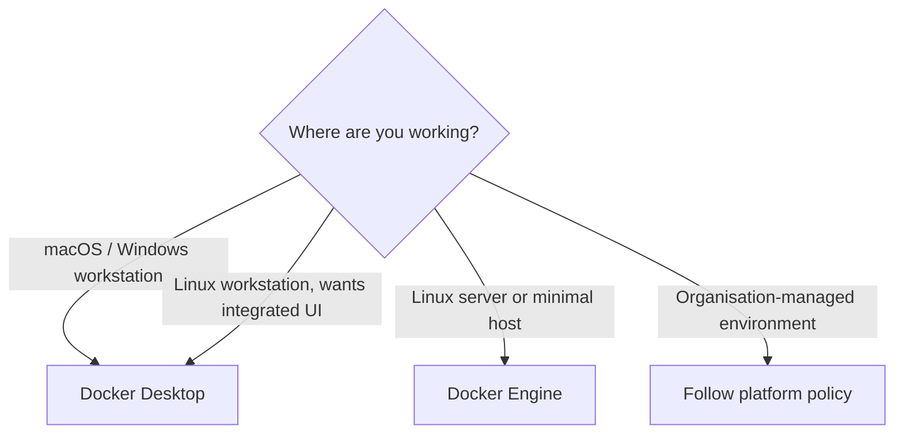

**Created:** *<span class ="color-green">11.08.26, 12:00</span>*

**Note Type:** #map

**Hashtags:**
- **Relevance Tags:**
	- #docker #containers #mapofcontent
- **Topic Tags:**
	- #installation #setup

**Links / Tags:**
- **Relevance Links:**
	- Docker %% Parent; plain text prevents a child-to-parent graph edge %%
- **Topic Links:**
	- [[Docker Desktop]]
	- [[Docker Engine on Linux]]

---

# Docker Installation and Setup

> Choose Docker Desktop for an integrated workstation experience or Docker Engine directly on a supported Linux host.

## Key Ideas

- After installation, verify with `docker version`, `docker info`, and `docker run --rm hello-world`.
- Keep Docker updated and understand who can access its privileged daemon or socket.

## Learning Path

- [[Docker Desktop]]
	- The packaged Docker development environment for macOS, Windows, and Linux.
- [[Docker Engine on Linux]]
	- The client-server runtime commonly used to build and run Docker containers directly on Linux.

## Deep Dive
## Installation Decision



After installing, verify each layer rather than relying on one successful icon:

```bash
docker version        # client and server/API information
docker info           # daemon, storage, cgroups, plugins, warnings
docker context ls     # which daemon the CLI targets
docker run --rm hello-world
```

If `docker version` shows client information but cannot reach the server, the CLI exists but the daemon/socket/context is unavailable. Do not solve permissions by making the Docker socket world-writable. Access to a normal rootful Docker daemon is highly privileged.

## Practical Check

- Explain how each child topic contributes to this part of the Docker workflow, then follow the links in order.

---

# Related Notes
> Things you might want to think about alongside this note, but not because of it


---
# References
- [Install Docker Engine](https://docs.docker.com/engine/install/)
- [Install Docker Desktop](https://docs.docker.com/desktop/)
