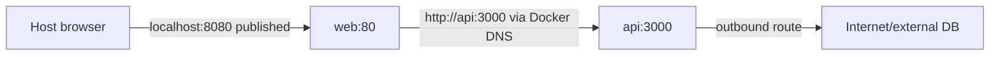

**Created:** *11.08.26, 12:00*

**Note Type:** #map

**Hashtags:**
- **Relevance Tags:**
	- #docker #containers #mapofcontent
- **Topic Tags:**
	- #networking

**Links / Tags:**
- **Relevance Links:**
	- Docker %% Parent; plain text prevents a child-to-parent graph edge %%
- **Topic Links:**
	- [[Docker Network Drivers]]
	- [[Docker Port Publishing]]
	- [[Docker DNS and Service Discovery]]

---

# Docker Networking

> How containers communicate with each other, the host, and external services.

## Key Ideas

- User-defined networks provide isolation and name-based discovery.
- Publishing a port makes a container service reachable outside its Docker network.
- Reason separately about container ports, host ports, interfaces, DNS names, and network membership.

## Learning Path

- [[Docker Network Drivers]]
	- Drivers implement different connectivity models for Docker networks.
- [[Docker Port Publishing]]
	- Mapping a host address and port to a port inside a container.
- [[Docker DNS and Service Discovery]]
	- Name resolution supplied on user-defined Docker and Compose networks.

## Deep Dive
## Three Different Paths

1. **Container to container:** attach both to a user-defined network and use DNS name plus container port.
2. **Host/external client to container:** publish a host address/port to a container port.
3. **Container to external service:** normal outbound routing, DNS, proxies, and firewall policy apply.

These paths are often confused. Publishing a database port is unnecessary for an application container on the same network. `EXPOSE 3000` does not create a host mapping. A process bound only to container loopback cannot accept traffic arriving on its network interface.

Network isolation is membership-based. If frontend and database should not communicate directly, put them on different networks and let an API service join both.

## Practical Check

- Explain how each child topic contributes to this part of the Docker workflow, then follow the links in order.

---

# Related Notes
> Things you might want to think about alongside this note, but not because of it

- [[Debugging Containers]] %% Conceptual overlap; intentionally reciprocal %%

- [[Docker Troubleshooting Playbook]] %% Conceptual overlap; intentionally reciprocal %%

---
# References
- [Networking overview](https://docs.docker.com/engine/network/)
