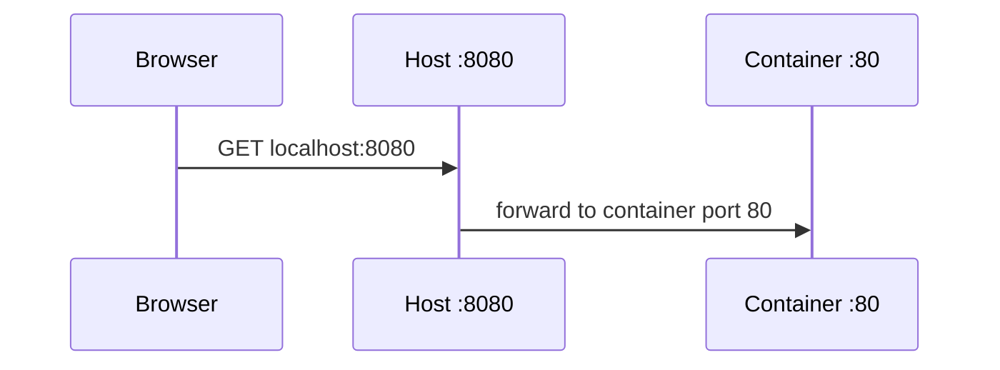

**Created:** *<span class ="color-green">11.08.26, 12:00</span>*

**Note Type:** #atomic

**Hashtags:**
- **Relevance Tags:**
	- #docker #containers
- **Topic Tags:**
	- #port #publishing

**Links / Tags:**
- **Relevance Links:**
	- Docker Networking %% Parent; plain text prevents a child-to-parent graph edge %%
- **Topic Links:**
	-

---

# Docker Port Publishing

> Mapping a host address and port to a port inside a container.

## Key Ideas

- `-p 8080:80` forwards host port 8080 to container port 80.
- Without a host IP, Docker commonly binds all host interfaces; use `127.0.0.1:8080:80` for local-only access.
- `EXPOSE` documents an intended container port but does not publish it.
- Container-to-container traffic on the same network normally uses the destination container port, not the published host port.

## Example

```bash
# Local machine only
docker run --rm -p 127.0.0.1:8080:80 nginx:alpine

# Inspect the mapping
docker port $(docker ps -q --filter ancestor=nginx:alpine)
```

## Deep Dive
## Read Mappings from Outside to Inside

```text
127.0.0.1:8080:80/tcp
└ host IP ┘│    └ container port
           └ host port
```



If the host IP is omitted, the port commonly binds on all interfaces, potentially exposing it beyond the laptop/server. For development, prefer `127.0.0.1:HOST:CONTAINER` unless LAN/public access is intended.

Troubleshoot in order: is the process running; is it listening on the expected container port and on `0.0.0.0`/appropriate interface; does `docker port` show the mapping; is the host port already used; do host firewall/cloud rules permit access?

Port publication is separate from `EXPOSE`, which documents image intent, and from Compose `expose`, which does not publish to the host.

## Practical Check

- Explain **Docker Port Publishing** in your own words and identify one situation where it matters in a real container workflow.

---

# Related Notes
> Things you might want to think about alongside this note, but not because of it

- [[Docker Runtime Configuration Options]] %% Conceptual overlap; intentionally reciprocal %%

- [[Docker Runtime Security]] %% Conceptual overlap; intentionally reciprocal %%

---
# References
- [Docker documentation](https://docs.docker.com/)
