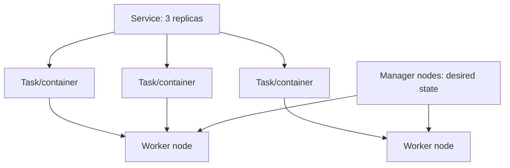

**Created:** *11.08.26, 12:00*

**Note Type:** #atomic

**Hashtags:**
- **Relevance Tags:**
	- #docker #containers
- **Topic Tags:**
	- #swarm

**Links / Tags:**
- **Relevance Links:**
	- Deploying Containers %% Parent; plain text prevents a child-to-parent graph edge %%
- **Topic Links:**
	-

---

# Docker Swarm

> Docker Engine’s built-in cluster orchestration mode for services across multiple nodes.

## Key Ideas

- A service declares desired replicas, image, networks, secrets, and update behaviour.
- Managers maintain cluster state; workers run tasks.
- Overlay networks connect services across nodes and the routing mesh can publish service ports.
- Swarm is simpler than some orchestrators but has a smaller ecosystem than Kubernetes.

## Deep Dive
## Swarm Model

A **service** declares desired state; a **task** is one scheduled container instance. Managers use consensus for cluster state, so manager count and failure-domain placement matter. Workers execute assigned tasks.

Swarm supports rolling updates, secrets/configs, overlay networking, service discovery, and published services. Stack deployment accepts a Compose-like file, but not every local Compose feature has the same orchestration meaning.

Use Swarm when its simpler Docker-native operational model meets requirements. Evaluate ecosystem, autoscaling, policy, storage, observability, community support, and organisational longevity against alternatives.

## Practical Check

- Explain **Docker Swarm** in your own words and identify one situation where it matters in a real container workflow.

---

# Related Notes
> Things you might want to think about alongside this note, but not because of it

---
# References
- [Docker documentation](https://docs.docker.com/)
