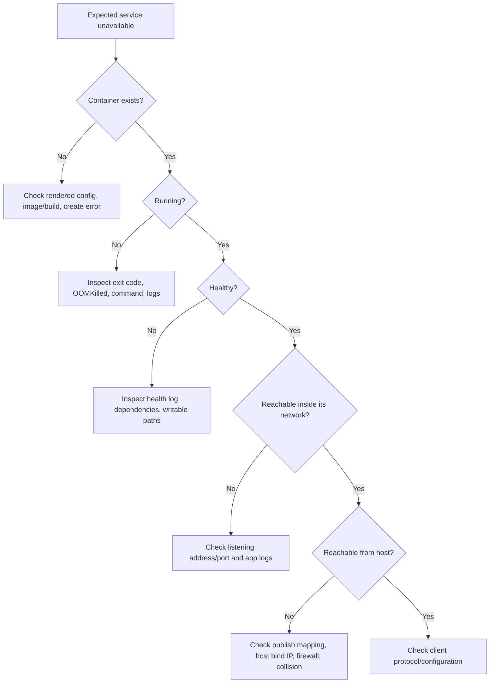

**Created:** *<span class ="color-green">11.08.26, 12:00</span>*

**Note Type:** #atomic

**Hashtags:**
- **Relevance Tags:**
	- #docker #containers #troubleshooting
- **Topic Tags:**
	- #debugging #diagnostics #operations

**Links / Tags:**
- **Relevance Links:**
	- Docker %% Parent; plain text prevents a child-to-parent graph edge %%
- **Topic Links:**
	-

---

# Docker Troubleshooting Playbook

> Diagnose from observed state and boundaries instead of repeatedly changing options.

## First Five Commands

```bash
docker context show
docker ps -a
docker inspect CONTAINER
docker logs --timestamps --tail 200 CONTAINER
docker stats --no-stream CONTAINER
```

For Compose, begin with `docker compose config`, `docker compose ps -a`, and `docker compose logs`.

## Decision Tree



## Symptom: Container Exits Immediately

Check `.State.ExitCode`, `.State.Error`, `.State.OOMKilled`, the effective `Path`/`Args`, and logs. Common causes include:

- the command completed normally;
- executable or shared library missing;
- wrong architecture;
- shell-form quoting/expansion mistake;
- permission denied for executable, user, or directory;
- required variable/file missing;
- application daemonised and PID 1 exited;
- memory limit triggered an OOM kill.

## Symptom: Port Is Not Reachable

Work from inside outward:

1. Is the application listening on the expected **container port**?
2. Is it bound to `0.0.0.0`/the container interface rather than only container `127.0.0.1`?
3. Does `docker port CONTAINER` show the intended host mapping?
4. Is another host process using the host port?
5. Was it bound to local-only or all interfaces as intended?
6. Do firewall, VPN, cloud, or Desktop networking rules permit the path?

## Symptom: Services Cannot Connect

- Confirm both containers share a user-defined network.
- Use service/container DNS name, not `localhost` and not a stale IP.
- Use the destination’s container port, not its host-published port.
- Test DNS resolution and TCP reachability from a diagnostic container.
- Treat connection refused as different from timeout and name-resolution failure.
- Add bounded retry/backoff for dependencies that are discoverable but not ready.

## Symptom: Files Are Missing or Permissions Fail

Inspect `Mounts`. A mount may hide files originally present in the image. Confirm source/destination spelling, host path existence, read-only mode, numeric UID/GID, Desktop file sharing, SELinux labels where applicable, and whether the process needs a writable directory on a read-only root.

Avoid “fixes” such as `chmod -R 777`, running as root, or `--privileged`. They erase useful diagnostic boundaries and create security problems.

## Symptom: Build Cache Looks Wrong

- Check `.dockerignore` and build context.
- Identify the first layer that unexpectedly invalidated.
- Remember `COPY` inputs affect cache.
- Move stable dependency manifests before changing source.
- Use `--no-cache` to test layer reuse assumptions and `--pull` separately to refresh the base.
- Verify lockfiles rather than depending on mutable remote package resolution.

## Evidence to Save

Record exact image reference/digest, Docker and host versions, effective Compose configuration, relevant inspect sections, timestamps, logs, reproduction command, and what changed. A good incident note allows someone else to reproduce the boundary where reality diverged from expectation.

---

# Related Notes
> Things you might want to think about alongside this note, but not because of it

- [[Debugging Containers]] %% Diagnostic workflow overlap; intentionally reciprocal %%
- [[Docker Networking]] %% Network-diagnosis overlap; intentionally reciprocal %%

---
# References
- [Docker Engine troubleshooting](https://docs.docker.com/engine/daemon/troubleshoot/)
