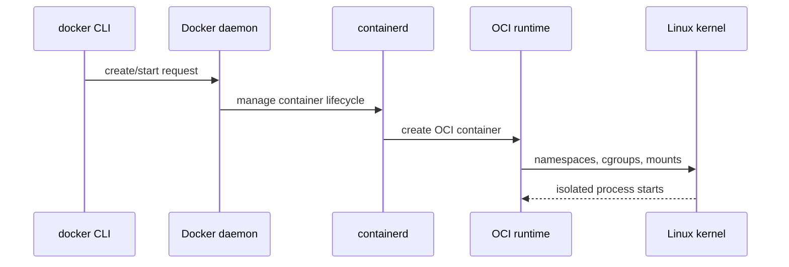

**Created:** *11.08.26, 12:00*

**Note Type:** #map

**Hashtags:**
- **Relevance Tags:**
	- #docker #containers #mapofcontent
- **Topic Tags:**
	- #underlying #technologies

**Links / Tags:**
- **Relevance Links:**
	- Docker %% Parent; plain text prevents a child-to-parent graph edge %%
- **Topic Links:**
	- [[Linux Namespaces]]
	- [[Linux Control Groups]]
	- [[Union Filesystems]]

---

# Docker Underlying Technologies

> The Linux mechanisms that make process isolation, resource control, and layered images possible.

## Key Ideas

- Namespaces shape what a process can see.
- Control groups shape how many resources it can consume.
- Layered and union filesystem techniques make images reusable and efficient.

## Learning Path

- [[Linux Namespaces]]
	- A Linux kernel feature that gives processes isolated views of system resources.
- [[Linux Control Groups]]
	- Control groups, or cgroups, organise processes and account for or limit their resource use.
- [[Union Filesystems]]
	- Layered filesystem techniques combine read-only image layers with a thin writable container layer.

## Deep Dive
## From Command to Process

The exact implementation evolves, but the conceptual responsibilities are stable. Docker provides the API, image/build/network/storage integrations, and user workflow. A lower-level runtime manages lifecycle. The Linux kernel supplies the actual isolation and scheduling primitives.

This matters during debugging: a Docker error may originate from image metadata, daemon policy, storage drivers, the network stack, kernel support, or the application process. “Docker is broken” is rarely a sufficiently precise diagnosis.

## Practical Check

- Explain how each child topic contributes to this part of the Docker workflow, then follow the links in order.

---

# Related Notes
> Things you might want to think about alongside this note, but not because of it

---
# References
- [Docker Engine security](https://docs.docker.com/engine/security/)
