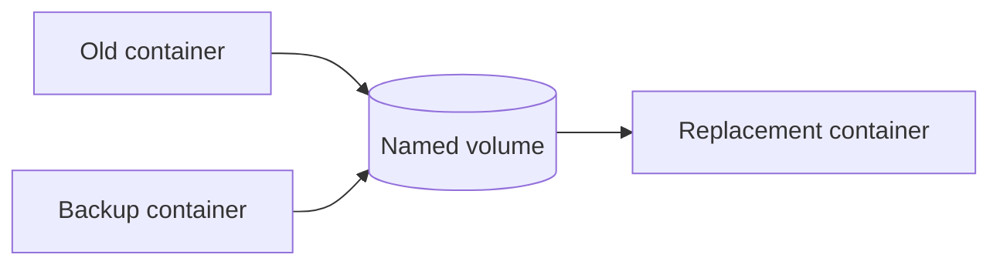

**Created:** *<span class ="color-green">11.08.26, 12:00</span>*

**Note Type:** #atomic

**Hashtags:**
- **Relevance Tags:**
	- #docker #containers
- **Topic Tags:**
	- #volumes

**Links / Tags:**
- **Relevance Links:**
	- Docker Data Persistence %% Parent; plain text prevents a child-to-parent graph edge %%
- **Topic Links:**
	-

---

# Docker Volumes

> Docker-managed storage that persists independently of any single container.

## Key Ideas

- Create with `docker volume create NAME` or let Docker/Compose create it.
- Mount with `--mount type=volume,src=NAME,dst=/data`.
- Volumes are a good default for databases and application-managed state.
- Backups must copy consistent application data; a volume is persistence, not automatically a backup.

## Example

```bash
docker volume create app-data
docker run --rm --mount type=volume,src=app-data,dst=/data alpine \
  sh -c 'echo persistent > /data/example.txt'
docker run --rm --mount type=volume,src=app-data,dst=/data alpine cat /data/example.txt
```

## Deep Dive
## Volume Lifecycle and Data Flow



Named volumes decouple data identity from container identity. Compose normally prefixes volume names with the project name, preventing unrelated projects from colliding. Mark a volume `external: true` only when its lifecycle is deliberately managed outside that Compose project.

### Initial population

When an empty volume is mounted over a directory that contains files in the image, Docker can copy the existing directory content into the volume by default. Do not rely on this as a general database migration mechanism; initialise and migrate data explicitly.

### Backup pattern

First make the application consistent—stop writes, use a database-native backup, or take a storage snapshot. A filesystem archive alone may capture an inconsistent database.

```bash
docker run --rm \
  --mount type=volume,src=app-data,dst=/data,readonly \
  --mount type=bind,src="$PWD/backups",dst=/backup \
  alpine tar -czf /backup/app-data.tgz -C /data .
```

Before `docker volume rm` or `docker volume prune`, inspect consumers and confirm recovery. Prune is a garbage-collection command, not ordinary housekeeping.

## Practical Check

- Explain **Docker Volumes** in your own words and identify one situation where it matters in a real container workflow.

---

# Related Notes
> Things you might want to think about alongside this note, but not because of it

- [[Docker Volume Commands]] %% Conceptual overlap; intentionally reciprocal %%

- [[Running Databases in Docker]] %% Conceptual overlap; intentionally reciprocal %%

- [[Docker Compose]] %% Conceptual overlap; intentionally reciprocal %%

---
# References
- [Docker documentation](https://docs.docker.com/)
