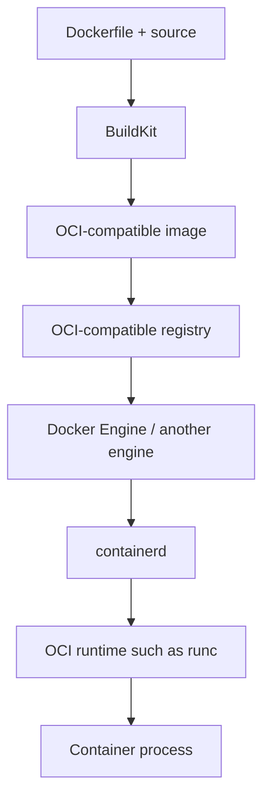

**Created:** *11.08.26, 12:00*

**Note Type:** #atomic

**Hashtags:**
- **Relevance Tags:**
	- #docker #containers
- **Topic Tags:**
	- #docker

**Links / Tags:**
- **Relevance Links:**
	- Introduction to Docker %% Parent; plain text prevents a child-to-parent graph edge %%
- **Topic Links:**
	-

---

# Docker and OCI

> Docker uses open container standards maintained by the Open Container Initiative.

## Key Ideas

- The OCI Image Specification describes image manifests, configurations, and filesystem layers.
- The OCI Runtime Specification describes the bundle and lifecycle used to run a container.
- Standards allow an image built with Docker to be consumed by other compatible tools.
- Docker is a broader developer product; OCI defines interoperability contracts rather than a complete platform.

## Deep Dive
## Standards and Implementations

Docker popularised the workflow, while OCI extracted interoperable specifications. Keep these layers distinct:

- The **Image Specification** defines manifests, configuration, descriptors, and filesystem layers.
- The **Distribution Specification** defines registry interactions for moving content.
- The **Runtime Specification** defines the filesystem bundle and runtime configuration used to create a container.

Dockerfiles and Compose are not OCI specifications. They are higher-level developer interfaces. OCI compatibility is why an image can move between Docker, containerd-based Kubernetes nodes, Podman, and many registries, subject to architecture and runtime requirements.

An image digest is derived from content. A tag is a mutable name pointing to content. This distinction becomes essential for repeatable deployments and supply-chain verification.

## Practical Check

- Explain **Docker and OCI** in your own words and identify one situation where it matters in a real container workflow.

---

# Related Notes
> Things you might want to think about alongside this note, but not because of it

- [[Kubernetes for Docker Users]] %% Conceptual overlap; intentionally reciprocal %%

---
# References
- [Open Container Initiative](https://opencontainers.org/)
- [OCI specifications](https://github.com/opencontainers)
