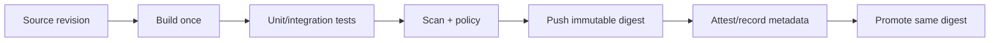

**Created:** *11.08.26, 12:00*

**Note Type:** #atomic

**Hashtags:**
- **Relevance Tags:**
	- #docker #containers
- **Topic Tags:**
	- #continuous #integration

**Links / Tags:**
- **Relevance Links:**
	- Docker Developer Experience %% Parent; plain text prevents a child-to-parent graph edge %%
- **Topic Links:**
	-

---

# Docker in Continuous Integration

> Building, testing, scanning, and publishing images in an automated pipeline.

## Key Ideas

- Use immutable source revisions and produce one release image that is promoted between environments.
- Cache dependencies and build layers without allowing stale or untrusted cache content to hide failures.
- Use registry credentials with minimal scope and avoid exposing secrets in logs or layers.
- Record digests, test results, vulnerability findings, and provenance for the published artifact.

## Deep Dive
## Recommended Pipeline

### Cache without losing trust

External BuildKit cache can accelerate CI, but cache keys, write permissions, and branch trust matter. Untrusted pull-request code should not overwrite a protected release cache or receive push credentials.

### Credential boundaries

- Use short-lived workload identity or scoped tokens.
- Log in only for the step that needs registry access.
- Never echo secret values or pass them into Dockerfile `ARG`.
- Separate pull, cache-write, and release-push permissions.

The pipeline should report the image digest, source revision, tests, scan result, and build provenance. Tagging the same digest after approval is promotion; rebuilding is a new artifact and requires retesting.

## Practical Check

- Explain **Docker in Continuous Integration** in your own words and identify one situation where it matters in a real container workflow.

---

# Related Notes
> Things you might want to think about alongside this note, but not because of it

- [[Testing with Docker]] %% Conceptual overlap; intentionally reciprocal %%

- [[Dockerfiles]] %% Conceptual overlap; intentionally reciprocal %%

- [[Efficient Docker Layer Caching]] %% Conceptual overlap; intentionally reciprocal %%

- [[Docker Image Tagging Best Practices]] %% Conceptual overlap; intentionally reciprocal %%

- [[Docker Capstone Project]] %% Conceptual overlap; intentionally reciprocal %%

---
# References
- [Docker documentation](https://docs.docker.com/)
