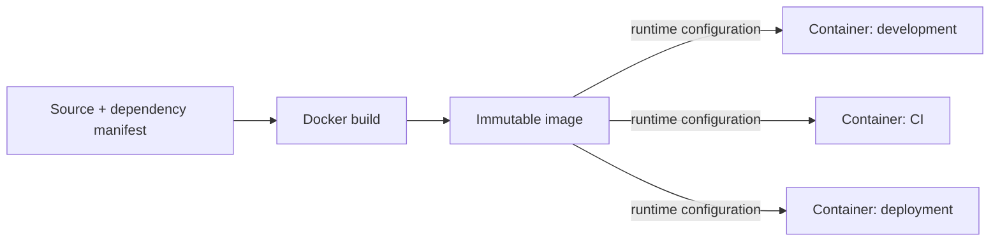

**Created:** *11.08.26, 12:00*

**Note Type:** #map

**Hashtags:**
- **Relevance Tags:**
	- #docker #containers #mapofcontent
- **Topic Tags:**
	- #introduction

**Links / Tags:**
- **Relevance Links:**
	- Docker %% Parent; plain text prevents a child-to-parent graph edge %%
- **Topic Links:**
	- [[What Are Containers]]
	- [[Why We Need Containers]]
	- [[Bare Metal vs Virtual Machines vs Containers]]
	- [[Docker and OCI]]

---

# Introduction to Docker

> The ideas and trade-offs that explain what Docker is and where containers fit.

## Key Ideas

- Start with containers as isolated processes rather than tiny virtual machines.
- Compare deployment models and understand the standards behind compatible images and runtimes.

## Learning Path

- [[What Are Containers]]
	- A container is an isolated process, or group of processes, created from an image and constrained by operating-system features.
- [[Why We Need Containers]]
	- Containers make an application environment reproducible and portable across development, testing, and deployment.
- [[Bare Metal vs Virtual Machines vs Containers]]
	- Three deployment models with different isolation, density, and operational trade-offs.
- [[Docker and OCI]]
	- Docker uses open container standards maintained by the Open Container Initiative.

## Deep Dive
## The Problem Docker Solves

Without a packaging boundary, an application depends on an accidental collection of host state: language runtime versions, system libraries, configuration files, users, ports, and installation steps. “It works on my machine” means the machine has become an undocumented part of the application.

Docker introduces a repeatable boundary:

The image is not the whole environment. Kernel behaviour, CPU architecture, mounted files, secrets, network policy, and runtime configuration still come from the platform. Portability therefore means **a standard package plus an explicit runtime contract**, not “identical behaviour everywhere regardless of host.”

## Vocabulary to Fix Early

| Word | Meaning |
|---|---|
| Image | Immutable package and defaults used to create containers |
| Container | Isolated runtime instance of an image |
| Registry | Service that stores and distributes images |
| Dockerfile | Build recipe for producing an image |
| Compose file | Runtime model for a multi-container application |
| Volume | Docker-managed storage with a lifecycle separate from containers |

## Practical Check

- Explain how each child topic contributes to this part of the Docker workflow, then follow the links in order.

---

# Related Notes
> Things you might want to think about alongside this note, but not because of it

---
# References
- [Docker documentation](https://docs.docker.com/)
