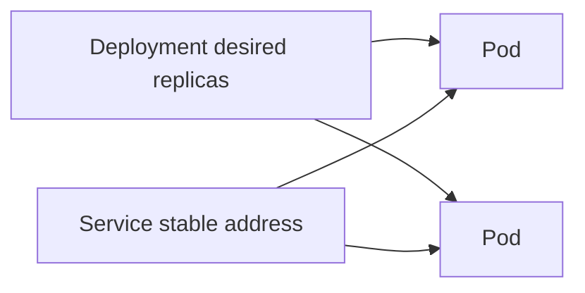

**Created:** *11.08.26, 12:00*

**Note Type:** #atomic

**Hashtags:**
- **Relevance Tags:**
	- #docker #containers
- **Topic Tags:**
	- #kubernetes #users

**Links / Tags:**
- **Relevance Links:**
	- Deploying Containers %% Parent; plain text prevents a child-to-parent graph edge %%
- **Topic Links:**
	-

---

# Kubernetes for Docker Users

> A container orchestration platform that schedules OCI containers using declarative resources.

## Key Ideas

- A Pod is the smallest scheduling unit and can contain one or more tightly coupled containers.
- Deployments manage replicated stateless Pods; Services provide stable network access.
- ConfigMaps, Secrets, persistent volumes, probes, and resource requests/limits express runtime needs.
- A Dockerfile builds the image, but Docker Compose files do not directly become production Kubernetes architecture.

## Deep Dive
## Concept Translation

| Docker/Compose idea | Kubernetes approximation | Important difference |
|---|---|---|
| Container | Container in a Pod | Pod is the scheduling/lifecycle unit |
| Compose service | Deployment + Service | Separate workload and stable networking objects |
| Compose project network | Cluster networking/NetworkPolicy | Different model and implementation |
| Named volume | PVC/PV | Storage classes and scheduling matter |
| Environment/config | ConfigMap/Secret | Platform-managed injection and policy |
| Health check | Liveness/readiness/startup probes | Each has a distinct orchestration effect |

Kubernetes does not normally build Dockerfiles; it schedules images already available in a registry. Modern clusters commonly use containerd or another CRI runtime, not Docker Engine, while still running OCI-compatible images built with Docker.

Learn requests/limits, probes, Services, Deployments, ConfigMaps/Secrets, storage, rollouts, and observability before advanced controllers. Converting Compose syntax mechanically is not the same as designing a reliable Kubernetes workload.

## Practical Check

- Explain **Kubernetes for Docker Users** in your own words and identify one situation where it matters in a real container workflow.

---

# Related Notes
> Things you might want to think about alongside this note, but not because of it

- [[Docker and OCI]] %% Conceptual overlap; intentionally reciprocal %%

---
# References
- [Docker documentation](https://docs.docker.com/)
