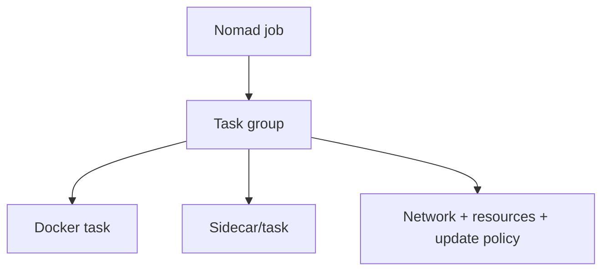

**Created:** *11.08.26, 12:00*

**Note Type:** #atomic

**Hashtags:**
- **Relevance Tags:**
	- #docker #containers
- **Topic Tags:**
	- #nomad #container #deployment

**Links / Tags:**
- **Relevance Links:**
	- Deploying Containers %% Parent; plain text prevents a child-to-parent graph edge %%
- **Topic Links:**
	-

---

# Nomad for Container Deployment

> HashiCorp Nomad is a scheduler that can run container and non-container workloads.

## Key Ideas

- Jobs describe task groups, tasks, resources, networks, and update strategy.
- Nomad is often combined with external service discovery, secrets, and storage systems.
- Its operational model can be simpler than Kubernetes for some teams and workloads.
- Evaluate ecosystem integrations, multi-tenancy, networking, and organisational expertise before choosing it.

## Deep Dive
## Scheduling Model

A Nomad job contains groups; groups contain tasks that are co-scheduled. Tasks may use Docker or other drivers. This broader workload model is one reason teams consider Nomad.

Nomad intentionally delegates parts of a full platform to integrations: service discovery/networking, secrets, ingress, and storage may involve Consul, Vault, CSI, or other systems. “Simpler scheduler” does not mean “no platform architecture.”

Evaluate failure recovery, multi-region needs, identity, policy, observability, autoscaling, stateful workloads, ecosystem maturity, and the team’s ability to operate the complete stack.

## Practical Check

- Explain **Nomad for Container Deployment** in your own words and identify one situation where it matters in a real container workflow.

---

# Related Notes
> Things you might want to think about alongside this note, but not because of it

---
# References
- [Docker documentation](https://docs.docker.com/)
