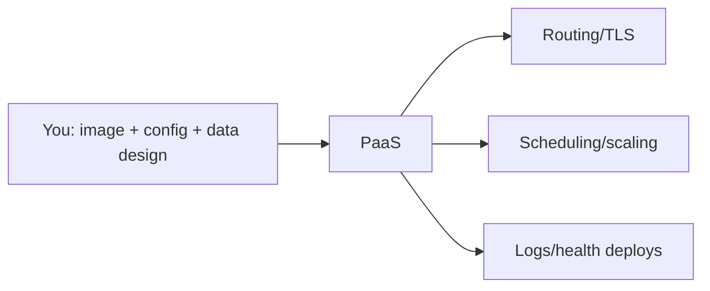

**Created:** *11.08.26, 12:00*

**Note Type:** #atomic

**Hashtags:**
- **Relevance Tags:**
	- #docker #containers
- **Topic Tags:**
	- #paas #container #deployment

**Links / Tags:**
- **Relevance Links:**
	- Deploying Containers %% Parent; plain text prevents a child-to-parent graph edge %%
- **Topic Links:**
	-

---

# PaaS Container Deployment Options

> Managed platforms that deploy an image or source with less infrastructure management.

## Key Ideas

- Typical features include HTTPS routing, logs, secrets, scaling, health checks, and managed build/deploy workflows.
- Review cold starts, regional availability, persistent storage, networking, observability, and pricing.
- Confirm whether the platform runs arbitrary OCI images and how it handles background workers and scheduled jobs.
- PaaS improves convenience but introduces platform-specific limits and migration considerations.

## Deep Dive
## Responsibility Trade-off

A container PaaS usually hides nodes and schedulers behind a smaller application interface. This is often the best beginner-to-team choice when standard web services and workers fit platform constraints.

Ask before choosing:

- Does it accept an arbitrary OCI image or require its own build system?
- Are services always running, scale-to-zero, or request-driven?
- How do private networking, egress, custom domains, TLS, jobs, and workers work?
- Are files ephemeral; which managed databases/object stores are available?
- What are CPU/memory/time limits and billing dimensions?
- How are secrets, rollbacks, regions, logs, and metrics handled?

Portability improves when the application listens on a configurable port, logs to stdout/stderr, externalises state, shuts down gracefully, and avoids provider-only filesystem assumptions.

## Practical Check

- Explain **PaaS Container Deployment Options** in your own words and identify one situation where it matters in a real container workflow.

---

# Related Notes
> Things you might want to think about alongside this note, but not because of it

---
# References
- [Docker documentation](https://docs.docker.com/)
