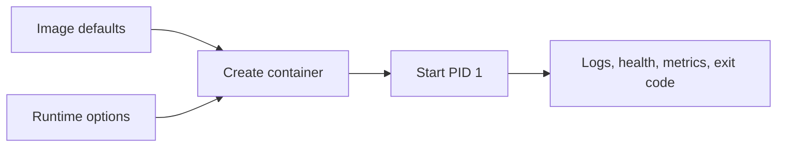

**Created:** *11.08.26, 12:00*

**Note Type:** #map

**Hashtags:**
- **Relevance Tags:**
	- #docker #containers #mapofcontent
- **Topic Tags:**
	- #running #containers

**Links / Tags:**
- **Relevance Links:**
	- Docker %% Parent; plain text prevents a child-to-parent graph edge %%
- **Topic Links:**
	- [[docker run]]
	- [[Docker Compose]]
	- [[Docker Runtime Configuration Options]]

---

# Running Containers

> Creating containers from images with the configuration needed by a workload.

## Key Ideas

- Use `docker run` for one-off or single-container tasks.
- Use Compose to describe repeatable multi-container applications.
- Make ports, mounts, environment, limits, health checks, and restart behaviour explicit.

## Learning Path

- [[docker run]]
	- The primary command for creating and starting one container.
- [[Docker Compose]]
	- A declarative way to define and operate a multi-container application in a YAML file.
- [[Docker Runtime Configuration Options]]
	- Settings applied when a container is created without changing the image itself.

## Deep Dive
## From Image to Observable Process

Before running an image, answer: What command will execute? Which user? Which ports need external access? Which files must persist? Which services must resolve each other? What resource and security limits apply? How will readiness and shutdown work?

### Attached versus detached

Attached mode connects the terminal to output and is easiest for learning and short tasks. Detached mode (`-d`) returns immediately; use `docker logs`, `docker ps`, and health status to observe it. Detachment does not make a process production-ready.

Use `--rm` for disposable commands, explicit names for long-lived local services, versioned images, and `127.0.0.1` host bindings when only the local machine needs access. Recreate containers when configuration changes rather than accumulating manual mutations.

## Practical Check

- Explain how each child topic contributes to this part of the Docker workflow, then follow the links in order.

---

# Related Notes
> Things you might want to think about alongside this note, but not because of it

---
# References
- [Docker documentation](https://docs.docker.com/)
