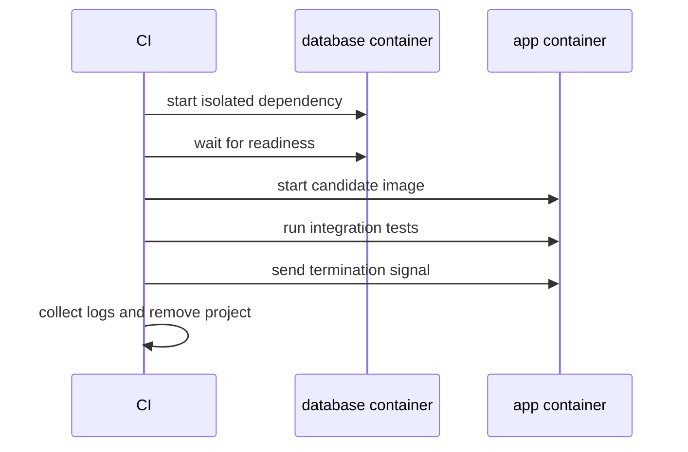

**Created:** *11.08.26, 12:00*

**Note Type:** #atomic

**Hashtags:**
- **Relevance Tags:**
	- #docker #containers
- **Topic Tags:**
	- #testing #with

**Links / Tags:**
- **Relevance Links:**
	- Docker Developer Experience %% Parent; plain text prevents a child-to-parent graph edge %%
- **Topic Links:**
	-

---

# Testing with Docker

> Using disposable containers to provide repeatable test environments and real service dependencies.

## Key Ideas

- Build the image in CI, run tests against it, and remove resources even when tests fail.
- Compose can start databases, brokers, and APIs on isolated project networks.
- Use health checks or explicit readiness probes instead of fixed sleeps.
- Keep test data deterministic and use unique project names or networks to avoid parallel-run collisions.

## Deep Dive
## Test the Artifact and Its Contract

Test at several levels:

- **Dockerfile build test:** clean build succeeds and required files/users/metadata exist.
- **Container smoke test:** process starts, health endpoint responds, signals stop it gracefully.
- **Integration test:** real database/broker dependencies run on an isolated network.
- **Security test:** image scan, non-root/read-only expectations, secret and port review.
- **Deployment contract test:** architecture, configuration, migration, and resource assumptions.

Use unique Compose project names in parallel jobs. Always collect logs before cleanup and perform cleanup in a finally/always step. Fixed sleeps are brittle; poll a meaningful readiness condition with a deadline.

## Practical Check

- Explain **Testing with Docker** in your own words and identify one situation where it matters in a real container workflow.

---

# Related Notes
> Things you might want to think about alongside this note, but not because of it

- [[Docker in Continuous Integration]] %% Conceptual overlap; intentionally reciprocal %%

- [[Running Databases in Docker]] %% Conceptual overlap; intentionally reciprocal %%

---
# References
- [Docker documentation](https://docs.docker.com/)
