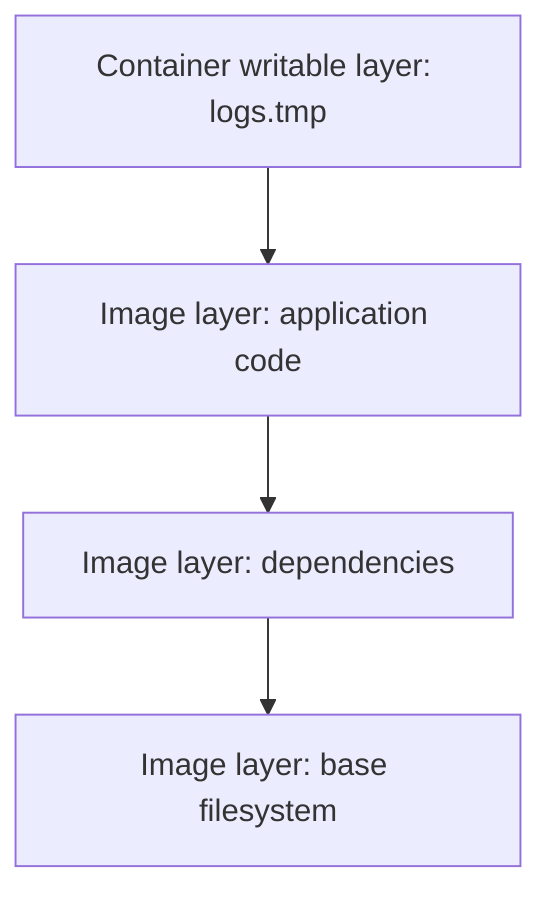

**Created:** *11.08.26, 12:00*

**Note Type:** #atomic

**Hashtags:**
- **Relevance Tags:**
	- #docker #containers
- **Topic Tags:**
	- #union #filesystems

**Links / Tags:**
- **Relevance Links:**
	- Docker Underlying Technologies %% Parent; plain text prevents a child-to-parent graph edge %%
- **Topic Links:**
	-

---

# Union Filesystems

> Layered filesystem techniques combine read-only image layers with a thin writable container layer.

## Key Ideas

- Layers are content-addressed and can be shared by multiple images and containers.
- A change creates data in an upper layer instead of modifying a lower layer directly.
- Deleting the container removes its writable layer, explaining why application data needs a mount.
- Image-layer design affects build cache reuse, transfer size, and security updates.

## Deep Dive
## The Layered Filesystem Model

Image layers are read-only. A container receives a writable layer above them. When software modifies a file from a lower layer, the storage driver uses copy-on-write behaviour: the file is copied into the writable layer and changed there. Different containers can therefore share image layers but keep independent changes.

Consequences:

- Image build order affects layer reuse and cache invalidation.
- Deleting a file in a later image layer hides it but does not necessarily remove its bytes from earlier layers.
- A secret copied into one layer and “deleted” in the next can remain recoverable from image history.
- Write-heavy databases should use suitable external storage rather than rely on the thin container layer.

“Union filesystem” is a useful mental model; the concrete Docker storage backend may use OverlayFS or another supported implementation.

## Practical Check

- Explain **Union Filesystems** in your own words and identify one situation where it matters in a real container workflow.

---

# Related Notes
> Things you might want to think about alongside this note, but not because of it

- [[Docker Images]] %% Conceptual overlap; intentionally reciprocal %%

---
# References
- [Docker documentation](https://docs.docker.com/)
