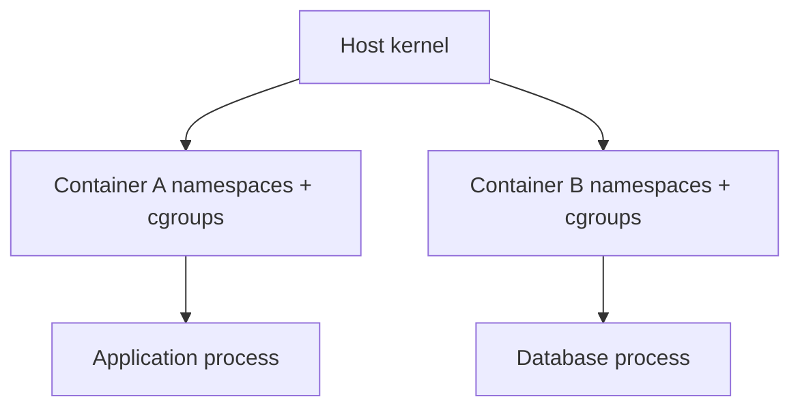

**Created:** *11.08.26, 12:00*

**Note Type:** #atomic

**Hashtags:**
- **Relevance Tags:**
	- #docker #containers
- **Topic Tags:**
	- #what #containers

**Links / Tags:**
- **Relevance Links:**
	- Introduction to Docker %% Parent; plain text prevents a child-to-parent graph edge %%
- **Topic Links:**
	-

---

# What Are Containers

> A container is an isolated process, or group of processes, created from an image and constrained by operating-system features.

## Key Ideas

- A container shares the host kernel; it does not normally boot a complete guest operating system.
- An image supplies the filesystem and defaults. Runtime configuration supplies environment, mounts, networks, limits, and secrets.
- Deleting a container deletes its writable layer, not the image or external volumes.

## Deep Dive
## Process, Not Machine

Run `docker run --rm alpine ps aux` and the output shows only a tiny process tree. The container is fundamentally one or more ordinary host processes whose view and resource access are restricted. On Linux, Docker asks the kernel to create namespaces, place processes into cgroups, prepare a layered root filesystem, configure networking, and then start the configured executable.

### What is isolated?

- Process IDs can appear independent from the host.
- Each container can have its own network interfaces, routes, and hostname.
- A container sees an image-derived root filesystem plus its mounts.
- Resource accounting and limits can be applied independently.

### What is shared?

- Linux containers on one Linux host share its kernel.
- Hardware, kernel vulnerabilities, and some host-wide resources remain shared concerns.
- Explicit bind mounts, devices, host namespaces, or the Docker socket intentionally weaken boundaries.

### PID 1 matters

The configured main process becomes PID 1 inside the container. Its exit stops the container. It must receive termination signals and reap child processes correctly. Prefer exec-form `ENTRYPOINT`/`CMD`; use `--init` if the application cannot correctly reap children.

## Practical Check

- Explain **What Are Containers** in your own words and identify one situation where it matters in a real container workflow.

---

# Related Notes
> Things you might want to think about alongside this note, but not because of it

- [[Linux Namespaces]] %% Conceptual overlap; intentionally reciprocal %%

- [[Linux Control Groups]] %% Conceptual overlap; intentionally reciprocal %%

---
# References
- [Docker documentation](https://docs.docker.com/)
